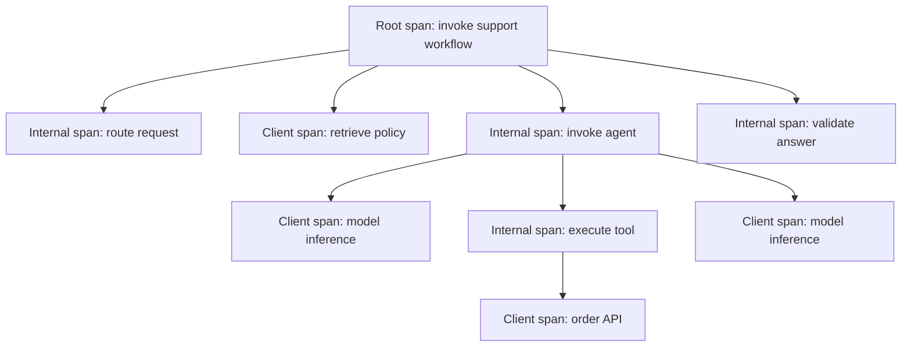
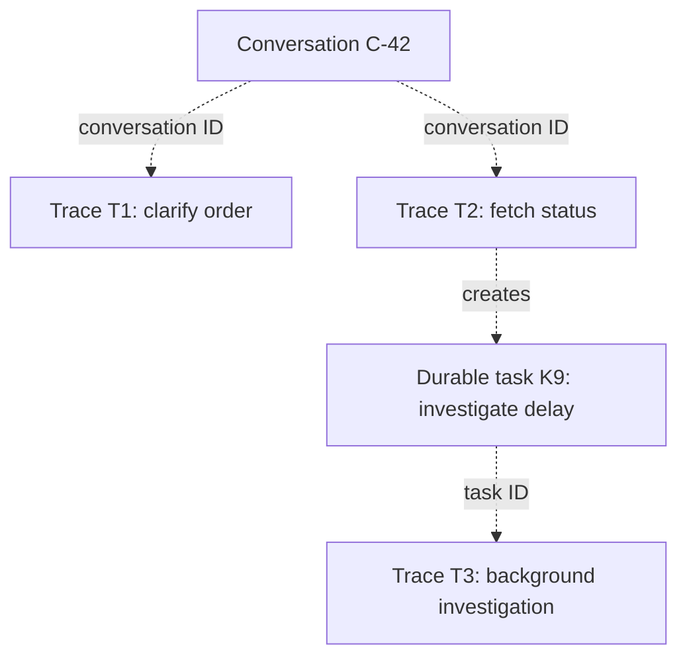

# The Telemetry Data Model

Most telemetry problems begin as modeling problems. If a conversation is represented as a parent span, a durable task as an HTTP request, or a quality score as a metric without its evaluation context, the resulting data may look valid while describing the system incorrectly.

This chapter defines the roles and boundaries of resources, traces, spans, span events, logs, metrics, baggage, conversations, durable tasks, links, and evaluation results. It then shows how those objects relate, which relationships belong to OpenTelemetry, which are application or backend conventions, and where operation-specific attributes should be recorded. By the end, the reader should be able to decide whether a fact belongs on a resource, span, event, log, metric, or evaluation record without inventing false parent-child relationships.

## OpenTelemetry objects and backend objects

OpenTelemetry defines signals and propagation. An observability backend can add higher-level objects such as projects, sessions, datasets, and scores. Those backend objects are useful, but they are not all nodes in an OpenTelemetry trace.

| Concept | Defined by | Relationship |
|---|---|---|
| Resource | OpenTelemetry | Describes the entity producing telemetry, such as a service. |
| Instrumentation scope | OpenTelemetry | Identifies the library or component emitting a signal. |
| Trace | OpenTelemetry | A graph of causally related spans sharing a trace ID. |
| Span | OpenTelemetry | A timed operation with context, attributes, events, links, and status. |
| Span event | OpenTelemetry | A timestamped occurrence inside a span. |
| Metric | OpenTelemetry | An aggregated measurement over dimensions and time. |
| Log record | OpenTelemetry | A timestamped record that can carry trace and span correlation. |
| Baggage | OpenTelemetry | Propagated key-value context; not telemetry storage. |
| Conversation/session | Application or backend | Correlates interactions that belong to one dialogue or user journey. |
| Evaluation score | Evaluation system or backend | A judgment attached to a trace, span, session, or dataset run. |
| Dataset | Evaluation system or backend | Versioned test cases used for experiments and release checks. |

Do not draw `session -> trace -> span` as if all three were OpenTelemetry parent-child relationships. Spans form the trace. A conversation ID is an attribute used to correlate traces or spans across turns.

## Resource

A resource describes the process or service emitting telemetry. Resource attributes should be stable across many operations:

```txt
service.name = "support-agent"
service.version = "2026.06.20"
deployment.environment.name = "production"
service.instance.id = "worker-7f9c"
```

Model name, conversation ID, tenant ID, prompt version, and tool name do not belong on the resource. They change per operation and belong on spans, logs, or metric data points.

## Trace and span

A trace represents one logical execution. A span represents one timed operation within it. Parent-child edges express causal nesting, not grouping convenience.



The tool span and its downstream HTTP span describe different operations. The tool span captures application meaning; the HTTP span captures transport behavior. Keep both. Collapsing them loses either business semantics or dependency detail.

### Span status is not business outcome

OpenTelemetry span status describes whether the operation completed with an error. Remember, a successful span can still produce a poor or unsafe result. Record business outcome separately with a bounded attribute or evaluation:

```txt
otel.status_code = UNSET
app.task.outcome = "escalated"
app.answer.grounded = false
```

Do not set span status to `ERROR` merely because an evaluation score is low. Doing so mixes execution failure with semantic quality and corrupts service error-rate metrics.

## Span events and logs

Use a span event for a notable occurrence that belongs to one operation:

```txt
event.name = "agent.budget.exhausted"
event.attributes = {
  "budget.type": "iterations",
  "budget.limit": 8,
  "budget.observed": 8
}
```

Use a log when the record needs an independent lifecycle, severity, body, or retention policy. Logs can carry `trace_id` and `span_id` so an operator can move between the trace and detailed diagnostics.

Exception stack traces belong in exception events or correlated logs. They should be sanitized because exception messages often include request data.

## Conversation and task

A conversation correlates turns. A task represents durable work. Neither must match a trace.



Use `gen_ai.conversation.id` when the application already has a real conversation or thread identifier. Do not derive it from a trace ID or request hash: a conversation can contain multiple executions, while a trace identifies only one observed execution.

The published OpenTelemetry GenAI semantic conventions do not currently define an adopted attribute for a task instance identifier. There is an open proposal for attributes such as `gen_ai.task.id` and `gen_ai.task.parent.id`, but proposed attributes are not part of the published specification and can change before adoption. Until a task convention is adopted, record the identifier under a documented project-specific namespace such as `app.task.id`. Using `gen_ai.task.id` before adoption should be treated as an explicit experimental schema decision, not as compliance with an OpenTelemetry standard.

## Links for non-parental relationships

Span links express relationships that are causal but not a simple parent-child tree. Typical cases include:

- A batch worker processing messages produced by several traces.
- A retry executed after the original trace has ended.
- A fan-in operation consuming results from parallel tasks.
- An evaluation job that analyzes a production trace later.

Links do not automatically make separate traces appear as one tree. Store stable correlation attributes as well when operators need to query the relationship.

## Metrics are projections, not miniature traces

Metrics should use bounded dimensions. Good dimensions include environment, operation name, model family, task type, status, and error category. Trace IDs, response IDs, raw user IDs, document IDs, and exception messages create unbounded cardinality and do not belong in metric labels.

Prefer histograms for latency, token counts, and cost distributions. Averages hide long tails and expensive outliers.

```txt
agent.task.duration                 histogram, unit s
agent.task.cost                     histogram, unit USD
agent.task.outcome                  counter by bounded outcome
agent.loop.limit_reached            counter by workflow and version
```

Metric names above are project-specific examples, not OpenTelemetry GenAI standard names.

## Evaluations are versioned evidence

An evaluation result needs more than a number:

```json
{
  "criterion": "policy_grounding",
  "result": "fail",
  "evaluator": "policy-grounding-judge",
  "evaluator_version": "7",
  "rubric_version": "2026-06",
  "evidence": ["span:retrieval.search", "document:policy-eu-v14"]
}
```

Store the full result in an evaluation system or backend score object. Emit bounded metric projections such as pass rate by task type and release. This preserves both aggregate monitoring and trace-level evidence.

## A modeling checklist

Before instrumenting an operation, answer:

1. Is this a timed operation, a point-in-time occurrence, an aggregate, or an evaluation?
2. Does it have a causal parent, or only a correlation/link relationship?
3. Which identifiers are stable enough for investigation but unsafe for metric dimensions?
4. Which fields are standard, which are custom, and which are backend-specific?
5. What retention and access policy applies to each signal?

## References

- [OpenTelemetry specification overview](https://opentelemetry.io/docs/reference/specification/overview/)
- [OpenTelemetry traces](https://opentelemetry.io/docs/concepts/signals/traces/)
- [OpenTelemetry baggage](https://opentelemetry.io/docs/concepts/signals/baggage/)
- [OpenTelemetry session semantic conventions](https://opentelemetry.io/docs/specs/semconv/general/session/)
- [OpenTelemetry GenAI semantic conventions](https://opentelemetry.io/docs/specs/semconv/gen-ai/)
- [Open proposal for GenAI task conventions](https://github.com/open-telemetry/semantic-conventions/issues/2665)
- [Langfuse data model](https://langfuse.com/docs/observability/data-model)

---

**Next up**: [Ch 3 - Semantic Conventions and Schema Governance](/observability-ai-agents/ch-03-semantic-conventions-schema-governance/) shows how to use evolving GenAI conventions without turning upgrades into silent schema changes.
