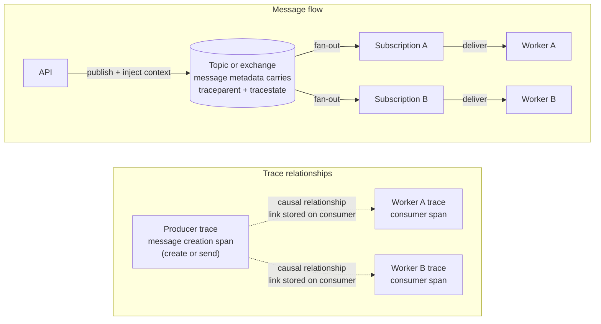
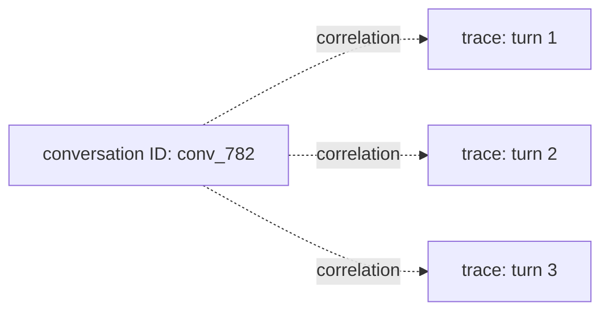

# Context Propagation Across Agent Workflows

An agent trace becomes fragmented when execution crosses a boundary without carrying its trace context. The model call still appears in the backend, as do the tool call and background worker, but they look like unrelated operations. Latency moves to disconnected root spans, errors lose the request that caused them, and a trace no longer explains the execution.

Agent systems cross many such boundaries: asynchronous tasks, thread pools, HTTP calls, queues, streaming callbacks, checkpoints, human approvals, and subagent delegation. This chapter defines what must cross each boundary and how to choose between a parent-child relationship, a span link, and an application correlation identifier.

## Four concepts that should not be conflated

OpenTelemetry uses several related objects during propagation:

| Concept | Purpose | Crosses process boundaries? |
|---|---|---|
| Context | Holds the currently active span and other runtime values while code executes. | Not directly. It is an in-process object. |
| Span context | Identifies a span using trace ID, span ID, trace flags, and optional trace state. | Yes, after a propagator serializes it. |
| Propagator and carrier | Inject context into a transport carrier and extract it on the receiving side. HTTP headers and message metadata are common carriers. | Yes. |
| Baggage | Carries application-defined key-value pairs alongside the trace context. | Yes, when the configured propagator includes baggage. |

W3C Trace Context is the default wire format used by many OpenTelemetry distributions:

```txt
traceparent: 00-4bf92f3577b34da6a3ce929d0e0e4736-00f067aa0ba902b7-01
tracestate: vendor=value
```

The `traceparent` value contains a version, trace ID, parent span ID, and trace flags. It does not contain span attributes, prompts, tool arguments, conversation history, or the span itself. The receiver extracts these identifiers and creates a local span that refers to the remote context.

## Parent, link, or correlation attribute?

Propagation transports context, but it does not decide the correct causal relationship. Make that decision from the execution semantics:

| Relationship | Use when | Important constraint |
|---|---|---|
| Parent-child | The operation is part of one execution and has one clear causal parent. | A span has at most one parent and remains in the parent's trace. |
| Span link | Work is causally related but starts an independent execution, has multiple causes, or already has another parent. | A span can link to multiple span contexts, including contexts from other traces. |
| Correlation attribute | Operations share a domain object but no direct execution dependency. | An identifier supports queries; it does not create trace causality. |

A synchronous model call inside an agent invocation is normally a child span. A consumer processing a batch of messages needs links to the creation context of each message because the consumer span cannot have multiple parents. Two turns in the same conversation can use `gen_ai.conversation.id` without belonging to the same trace.

Do not keep every related operation in one trace merely because a common identifier exists. Conversation membership, durable task membership, and trace causality answer different questions.

## In-process synchronous calls

`start_as_current_span` creates a span and makes it current for the duration of the context manager. Instrumented operations invoked inside the block can use it as their parent:

```python
from opentelemetry import trace

tracer = trace.get_tracer("support-agent.workflow")


def retrieve_policy(query: str) -> list[str]:
    with tracer.start_as_current_span("retrieve support-policy") as span:
        span.set_attribute("gen_ai.operation.name", "retrieval")
        span.set_attribute("gen_ai.data_source.id", "support-policy")
        return search_index(query)
```

The previous current context is restored when the block exits. Starting a span without making it current is valid, but downstream instrumented calls will not automatically treat that span as their parent.

Keep the span open for the operation it measures. For a streamed model response, ending the span when the response object is created records request setup time, not the duration of stream consumption.

## For async tasks

Python uses `contextvars` for the current OpenTelemetry context. An `asyncio` task normally captures the context active when the task is created, so parallel children can inherit the same parent:

```python
import asyncio
from opentelemetry import trace

tracer = trace.get_tracer("support-agent.workflow")


async def prepare_answer():
    with tracer.start_as_current_span("prepare answer"):
        policies, order = await asyncio.gather(
            retrieve_policies(),
            fetch_order(),
        )
        return policies, order
```

Both child operations should have `prepare answer` as their parent and should overlap in the trace timeline. Context can still be lost when a library registers a callback before the parent becomes current, creates work after the parent span has ended, or implements its own scheduler. Verify the emitted parent span IDs instead of assuming propagation works because the code uses `async`.

## Thread and process boundaries

Code submitted to a thread pool does not have a portable guarantee that the submitting thread's context will become current in the worker. Capture the Python context at submission time when the executor does not provide propagation:

```python
from concurrent.futures import ThreadPoolExecutor
from contextvars import copy_context


with ThreadPoolExecutor() as executor:
    submission_context = copy_context()
    future = executor.submit(submission_context.run, blocking_tool_call)
```

A copied context cannot be entered concurrently by multiple threads. Create a separate copy for each submitted operation.

Do not serialize Python context objects across process boundaries. Inject the OpenTelemetry context into a text carrier and extract it in the receiving process, just as for an HTTP or messaging boundary.

## Remote service calls

HTTP, RPC, and messaging instrumentations normally inject and extract context automatically. Manual propagation is necessary when a custom transport or uninstrumented client owns the boundary.

```python
from opentelemetry import propagate, trace
from opentelemetry.trace import SpanKind

tracer = trace.get_tracer("support-agent.transport")


def call_remote_tool(payload: dict):
    with tracer.start_as_current_span(
        "POST",
        kind=SpanKind.CLIENT,
    ) as span:
        span.set_attribute("http.request.method", "POST")
        span.set_attribute("server.address", "tools.internal")
        headers: dict[str, str] = {}
        propagate.inject(headers)
        return http_client.post("https://tools.internal/run", json=payload, headers=headers)


def handle_tool_request(request):
    remote_context = propagate.extract(request.headers)
    with tracer.start_as_current_span(
        "POST /run",
        context=remote_context,
        kind=SpanKind.SERVER,
    ) as span:
        span.set_attribute("http.request.method", "POST")
        span.set_attribute("http.route", "/run")
        return execute_tool(request.json)
```

Injection must happen while the outbound client span is current. Extraction must happen before the inbound server span starts. If an HTTP library is already instrumented, adding these spans manually can produce duplicate client or server spans; configure one instrumentation owner per boundary.

Treat incoming propagation data as untrusted metadata. A valid remote trace ID does not authenticate the caller and must not be used as an authorization or audit identity.

## Queues and background workers

A producer should attach a message creation context to each message. A consumer extracts that context when the message is delivered. In a point-to-point queue, multiple workers normally compete for a message and only one processes it. Fan-out occurs with publish/subscribe semantics, where a topic or exchange delivers the published message to multiple subscriptions. Messaging systems can also deliver several messages to one consumer in a batch.

Current OpenTelemetry messaging conventions use span links as the default correlation mechanism because links support both cases: several consumer spans can reference one message creation context, and one batch consumer span can reference several message creation contexts.



The upper layer shows one explicit fan-out scenario: the API injects the producer context into message metadata, and the broker routes the message through two subscriptions. Solid arrows describe messaging behavior, not span parentage. The lower layer shows the telemetry topology: each worker starts an independent trace, and each consumer span stores a link to the message creation span context.

For a point-to-point queue, remove one subscription path from the upper layer. One of the competing workers processes a particular message, so only that execution produces the corresponding consumer span.

The following simplified example implements the consumer side of that lower layer:

```python
from opentelemetry import propagate, trace
from opentelemetry.context import Context
from opentelemetry.trace import Link, SpanKind

tracer = trace.get_tracer("support-agent.worker")


def links_from_message(headers: dict[str, str]) -> list[Link]:
    extracted_context = propagate.extract(headers)
    message_span_context = trace.get_current_span(extracted_context).get_span_context()
    if not message_span_context.is_valid:
        return []
    return [Link(message_span_context)]


def process_message(message):
    with tracer.start_as_current_span(
        "process agent-tasks",
        context=Context(),
        kind=SpanKind.CONSUMER,
        links=links_from_message(message.headers),
    ) as span:
        span.set_attribute("messaging.system", "rabbitmq")
        span.set_attribute("messaging.operation.name", "process")
        span.set_attribute("messaging.operation.type", "process")
        span.set_attribute("messaging.destination.name", "agent-tasks.worker-a")
        run_task(message.body)
```

For a batch, add one link per message creation context and set the appropriate messaging batch attributes. In an exclusively single-message scenario, the messaging conventions also allow the creation context to be the consumer span's parent. Follow the instrumentation for the actual broker instead of imposing one trace shape on Kafka, RabbitMQ, SQS, and in-process queues.

## Durable execution and resume

A workflow that pauses for minutes or days creates an operational boundary even if the business task has not finished. Keeping one trace open across that interval can exceed backend limits, complicate tail-sampling decision windows, and mix inactive wait time with active execution latency.

A practical baseline is:

1. Create one trace for each active execution segment.
2. Persist the previous segment's propagation carrier with the checkpoint.
3. Start the resumed segment as a new trace linked to the previous segment's context.
4. Add a stable task identifier to every segment for domain-level queries.

```txt
app.task.id = "task_01J..."
app.task.segment = 3
app.task.resume_reason = "human_approved"
```

These are project-specific attributes, not adopted OpenTelemetry task conventions. The link preserves causal navigation between segments. `app.task.id` answers a different query: “show every execution segment for this durable task.”

Use one continuous trace only when pause durations, trace size, backend retention, and sampling behavior have been tested and the resulting trace remains operable.

## Conversation turns

Use `gen_ai.conversation.id` when the application has a real conversation or thread identifier. A conversation can contain many turns, and each turn can have its own trace:



Conversation ID is appropriate for trace and log queries. It is normally unsuitable as a metric dimension because the number of conversations grows without a fixed bound.

Do not generate a conversation ID for a stateless request, reuse the trace ID, or hash raw content to manufacture one. Missing correlation is preferable to false domain identity.

## Multi-agent handoffs

For multi-agent workflows, the relationship between coordinator and subagent depends on the handoff behavior. We can choose the relationship from the handoff behavior:

| Handoff | Trace model |
|---|---|
| A coordinator waits for a subagent during the same execution | Child `invoke_agent` span. |
| A coordinator delegates work that executes independently | New trace linked to the delegation span. |
| Several agents contribute to a later synthesis step | Synthesis span with links to the contributing execution contexts. |
| Agents only share a conversation or durable task | Separate traces correlated by the relevant domain identifier. |

Record bounded routing metadata when it helps explain the decision:

```txt
app.handoff.type = "delegate"
app.handoff.target = "refund-specialist"
app.handoff.reason = "policy_exception"
```

Do not record the complete handoff message by default. It is content and must follow the same capture, access, and retention policy as prompts and tool results.

## Baggage is propagated application data

Baggage carries application-defined key-value pairs with the propagation context. When a baggage propagator is configured, those values can be injected into outbound HTTP headers or message metadata and become available to downstream application code. Baggage is separate from span attributes: propagating a value does not automatically record it in telemetry.

Use baggage only when a small, low-sensitivity value must follow the execution and cannot be reconstructed by the receiving service. A validated release channel used to keep a request on the same canary path is a reasonable example:

```txt
baggage: app.release.channel=canary
```

The decision depends on how the value is consumed:

| Need | Appropriate location |
|---|---|
| Used only for trace investigation or filtering | Span attribute. |
| Needed by downstream application code and safe to propagate | Allowlisted baggage. |
| Controls authentication or authorization | Verified identity claims or application security context. |
| Large or structured data | Application storage; propagate an opaque reference when necessary. |
| Prompt, tool result, or conversation content | Do not use baggage. Apply the content-capture policy instead. |

Baggage received from an external request is untrusted input. An attacker can send a syntactically valid baggage header, so a service must not accept values such as `tenant.id`, `user.role`, or `policy.allowed` as evidence of identity or permission.

Apply controls at each trust boundary:

1. Remove unknown keys and reject values outside the documented format and size limits.
2. Add trusted baggage only after the application has validated or derived the value.
3. Forward approved keys to internal destinations that need them.
4. Remove baggage before calls to third-party services unless forwarding is explicitly required.
5. Copy an approved key to a span attribute only when the observability schema requires it.

Never include secrets, prompts, raw user identifiers, authorization decisions, or unrestricted customer-controlled text. Maintain ownership, allowed values, and size limits for every baggage key in the telemetry schema registry.

## Sampling depends on intact propagation

The final field in `traceparent` contains trace flags. Its least significant bit is the sampled flag:

```txt
traceparent: 00-4bf92f3577b34da6a3ce929d0e0e4736-00f067aa0ba902b7-01
                                                                       ^ sampled
```

The flag communicates an upstream head-sampling decision. It does not make the decision by itself. When a downstream SDK uses a parent-based sampler, a remote sampled parent normally produces sampled child spans, while a remote parent with the flag unset produces non-recording children. This keeps one distributed trace consistent across service boundaries.

If propagation breaks, the downstream service sees no remote parent and treats the operation as a new root. Its root sampler can then make a different decision. The backend may receive the upstream half, the downstream half, or two unrelated traces instead of one complete execution.

Head and tail sampling act at different points:

| Mechanism | Decision point | Propagation consequence |
|---|---|---|
| Head sampling | The SDK decides when a span is created, before the complete trace is known. | A parent-based sampler uses the propagated parent and sampled flag to keep child decisions consistent. |
| Tail sampling | A Collector decides after receiving spans from the trace. | Every relevant span must retain the same trace ID and reach the sampling decision point before its decision window closes. |

Tail sampling can retain a trace because a later span failed or exceeded a latency threshold. It cannot recover spans that an SDK never recorded or exported because of an earlier head-sampling decision. Routing different parts of a trace to independent tail-sampling Collectors can cause the same problem: neither Collector sees enough of the trace to evaluate it correctly.

Span links require a separate expectation. A consumer trace linked to a producer trace is still a new trace with its own root sampling decision. A link preserves causality, but it does not guarantee that both traces will be retained. Sampling policies that need both sides of a handoff must account for linked traces explicitly or use a stable task identifier to investigate the surviving segments.

A practical propagation baseline is:

1. Use compatible propagators and a parent-based sampler for services participating in the same trace.
2. Make the root head-sampling decision once instead of applying unrelated ratio decisions in every service.
3. When using tail sampling, avoid dropping spans in the SDK before they reach the Collector and route a trace's spans to the same decision point.
4. Treat linked traces as separate sampling units.
5. Test sampled, unsampled, missing, and malformed inbound trace contexts.

Chapter 6 defines concrete head- and tail-sampling policies, decision windows, and cost controls.

## Test the instrumentation at every execution boundary

These are automated tests of the application's instrumentation, not tests of OpenTelemetry itself. Their purpose is to prove that the application produces the trace topology defined in this chapter whenever execution crosses an async, thread, process, messaging, or agent boundary.

A typical test has three stages:

1. Configure a test tracer with an in-memory span exporter.
2. Execute a controlled workflow that crosses one boundary.
3. Inspect the exported spans and assert their trace IDs, parent span IDs, links, and approved baggage.

For a parent-child boundary, the assertion can look like this:

```python
def assert_child_of(child_span, parent_span):
    assert child_span.context.trace_id == parent_span.context.trace_id
    assert child_span.parent.span_id == parent_span.context.span_id
```

For independently sampled traces connected by a link, test the relationship separately:

```python
def assert_linked_to(linked_span, source_span):
    linked_contexts = [link.context for link in linked_span.links]
    assert source_span.context in linked_contexts
```

The workflow used by the test should match the boundary being verified:

| Boundary under test | Controlled execution | Expected telemetry topology |
|---|---|---|
| Inbound HTTP | Inject a client context into test request headers and run the server handler. | Server span uses the extracted remote parent; workflow span is a child of the server span. |
| Parallel async nodes | Run two instrumented coroutines with `asyncio.gather`. | Both child spans share the workflow parent and overlap in time. |
| Thread pool | Submit an instrumented function through the production executor wrapper. | Worker span remains a child of the submitting operation. |
| Pub/sub fan-out | Deliver message metadata from one producer to two test consumers. | Each consumer span links to the same message creation context. |
| Batch consumption | Process several messages in one instrumented consumer operation. | Consumer span contains one link for every message creation context in the batch. |
| Pause and resume | Persist a checkpoint carrier and invoke the resume handler. | Resumed root starts a new trace and links to the previous segment. |
| Synchronous subagent | Invoke a test subagent while the coordinator span is current. | `invoke_agent` span is a child of the coordinator operation. |
| Independent delegation | Enqueue a delegated task and run its handler independently. | Delegated trace links to the delegation span instead of using it as a parent. |

Add negative cases as well. Malformed inbound headers must not crash request handling, unapproved baggage must not cross the trust boundary, and an unsampled parent must produce the behavior configured by the parent-based sampler. Correlated logs created inside each operation should contain that operation's local trace and span IDs.

Unit tests can call producer and consumer handlers in one process while still exercising real `inject` and `extract` operations. Collector integration tests are a separate layer: they verify that serialization, processors, sampling, and backend export preserve the relationships already validated in memory. Chapter 18 builds both test layers.

## References

- [W3C Trace Context](https://www.w3.org/TR/trace-context/)
- [OpenTelemetry context propagation](https://opentelemetry.io/docs/concepts/context-propagation/)
- [OpenTelemetry Python propagation](https://opentelemetry.io/docs/languages/python/propagation/)
- [OpenTelemetry baggage](https://opentelemetry.io/docs/concepts/signals/baggage/)
- [OpenTelemetry messaging span conventions](https://opentelemetry.io/docs/specs/semconv/messaging/messaging-spans/)
- [OpenTelemetry sampling](https://opentelemetry.io/docs/concepts/sampling/)

---

**Next up**: [Ch 5 - Signals for Agent Systems](/observability-ai-agents/ch-05-signals-agent-observability/) defines the minimum useful signals at operation, trace, conversation, and fleet level.
