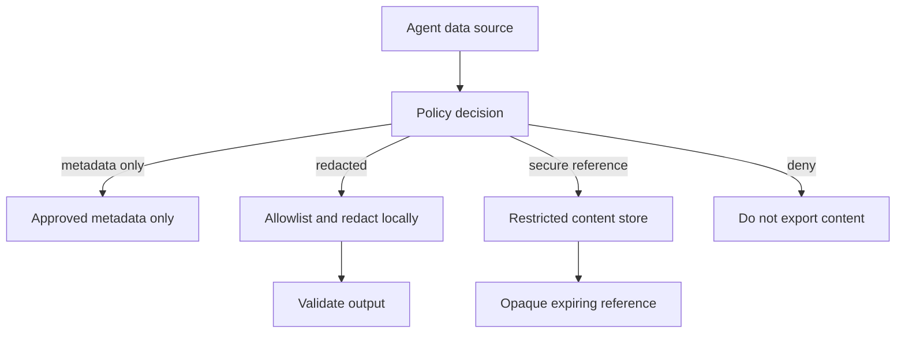
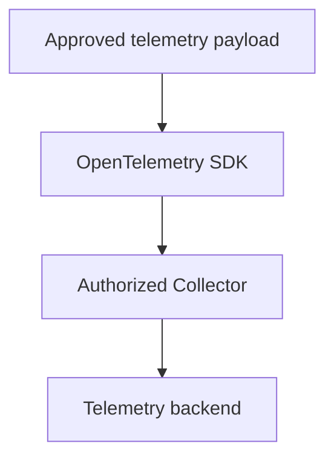

# Content Capture as a Data-Governance Decision

Prompts, model outputs, tool payloads, and retrieved documents are application data. Copying them into telemetry creates a new processing system with its own recipients, indexes, exports, backups, retention schedule, and incident surface. An observability backend does not become an approved content store merely because the SDK can send data to it.

The default for production is metadata-only telemetry. Capture content only when a named operational purpose cannot be met with safer data, the destination is authorized for that content class, and the complete lifecycle has an owner.

This is a data-governance decision. Data governance defines who may decide, which data may be processed, for which purpose, in which systems, for how long, and how compliance with that decision is verified. Chapter 8 implements privacy and PII defenses inside this governance boundary.

## OpenTelemetry makes content capture opt-in

The current OpenTelemetry GenAI conventions classify model instructions, input messages, and output messages as sensitive and potentially large. Instrumentations should not capture them by default, but may expose an opt-in configuration.

When enabled, the standard opt-in content attributes include:

| Attribute | Content represented | Capture posture |
|---|---|---|
| `gen_ai.system_instructions` | Instructions supplied separately from ordinary input messages. | Opt-in; disabled by default. |
| `gen_ai.input.messages` | User, assistant, tool, and other messages sent to the model. | Opt-in; disabled by default. |
| `gen_ai.output.messages` | Messages generated by the model, including structured or multimodal parts. | Opt-in; disabled by default. |
| `gen_ai.prompt.variable` | Runtime values supplied to a prompt template. | Opt-in; may contain sensitive data. |
| `gen_ai.tool.definitions` | Tool names, descriptions, and parameter schemas exposed to the model. | Opt-in; can be large. |
| `gen_ai.tool.call.arguments` | Arguments supplied to an `execute_tool` operation. | Opt-in; may contain sensitive data. |
| `gen_ai.tool.call.result` | Result returned by an `execute_tool` operation. | Opt-in; may contain sensitive data. |
| `gen_ai.retrieval.query.text` | Text submitted to a retrieval operation. | Opt-in; may contain sensitive data. |
| `gen_ai.retrieval.documents` | Retrieved document objects, expected to include at least document ID and score. | Opt-in; identifiers still need governance. |

The exact attributes and stability levels depend on the adopted semantic-convention version. Pin that version as described in Chapter 3. Do not re-enable deprecated per-message events alongside the current structured attributes, or the same content may be exported twice.

Structured content may be serialized as JSON strings when a language SDK cannot represent complex span attributes. Serialization changes the envelope, not the classification. It can also exceed SDK, Collector, or backend value limits. Truncation needs a declared policy because cutting a JSON string arbitrarily can produce invalid or misleading content.

## Inventory content across the complete agent path

The model request is not the telemetry boundary. Content can enter observability through framework callbacks, tool wrappers, exception logs, HTTP instrumentation, vector-store integrations, workflow checkpoints, evaluation jobs, and exporter fan-out.

Build the inventory before choosing attributes. For each source, identify the content class, the code path that can capture it, the telemetry signal that receives it, and the first system outside the application trust boundary. The output should answer one practical question: "Can this data reach an observability system without a deliberate governance decision?"

| Source | Examples | Frequent capture path |
|---|---|---|
| Instructions | System prompts, developer instructions, policy text. | GenAI instrumentation or prompt-management integration. |
| User input | Messages, forms, uploaded files, audio, images. | Root-span input, model messages, HTTP instrumentation. |
| Model output | Text, structured objects, refusals, reasoning content, generated media. | Model output attributes, framework callbacks, logs. |
| Tool execution | Arguments, results, approval comments, authorization context. | Function decorators, tool spans, exception messages. |
| Retrieval | Query, document IDs, chunks, scores, reranker inputs. | Retrieval spans, vector-store instrumentation, debug logs. |
| Agent state | Checkpoints, scratch state, short-term and long-term memory. | Workflow persistence hooks and state serialization. |
| Multi-agent exchange | Delegation instructions, handoff messages, shared state. | Producer and consumer spans or messaging payload capture. |
| Evaluation | Reference answers, judge input, scores, explanations, reviewer notes. | Evaluation events, datasets, experiment exports. |
| Runtime diagnostics | Exceptions, stack traces, URLs, HTTP bodies, database statements. | Automatic protocol instrumentation and application logs. |

The dangerous paths are often indirect. A tool wrapper may avoid exporting arguments, while the HTTP client logs the same request body on a 500. A retrieval span may record only document IDs, while a debug log prints the selected chunks. An evaluation job may copy a trace sample into a dataset with different access rules. Inventory the duplicate paths, not only the obvious GenAI attributes.

Multimodal references need the same review as inline text. A URI can reveal a bucket name, tenant, filename, signed access token, or private network location. A provider file ID can become a durable correlation identifier. An inline blob copies the media itself. Treat "reference only" as a data-processing decision, not as a free pass.

For each source, follow the data through the application, SDK queue, sidecar or gateway, every Collector processor, every Collector exporter, every backend, every search index, and every downstream export. Fan-out matters. A trace approved for one restricted backend can be copied to a general APM platform by a second exporter in the same pipeline.

The inventory should produce a small control table:

| Source | Allowed telemetry form | First enforcement point | Unauthorized path to block |
|---|---|---|---|
| Tool arguments | Redacted field paths and validation outcome. | Tool wrapper before span creation. | Exception logs containing the raw JSON payload. |
| Retrieval results | Document IDs and scores only. | Retrieval instrumentation hook. | Debug logs printing chunk text. |
| Uploaded image | Opaque media reference with expiry. | Upload service before model call. | Inline blob on model input attributes. |
| Evaluation sample | Restricted dataset reference. | Evaluation export job. | Copying prompt and output into a shared experiment table. |

## Classify before selecting a telemetry field

Classify the data before deciding where it goes. The telemetry field is an implementation detail; the classification determines whether the value can be collected, transformed, stored, queried, exported, and retained.

Use the organization's data-classification scheme rather than inventing a weaker observability-only scheme. Observability does not reduce the sensitivity of the data. A customer message copied to a trace is still a customer message.

At minimum, distinguish:

| Class | Agent examples | Default telemetry treatment |
|---|---|---|
| Public | Published product documentation, public model name. | May be recorded when operationally useful. |
| Internal | Prompt template, workflow state, internal document identifier. | Metadata-only unless the backend is approved for internal data. |
| Confidential | Customer conversation, private retrieved document, business process output. | Exclude by default; use redaction or a restricted content store. |
| Restricted | Credentials, authentication tokens, private keys, payment or regulated data. | Never send to ordinary observability storage. Block before export. |

Classification is contextual. An error category such as `timeout` is usually safe; the exception message may contain the complete tool URL and its bearer token. A document ID may be harmless in one system and encode a customer account number in another.

The classification should produce a concrete telemetry decision:

| Data example | Classification question | Safer telemetry form |
|---|---|---|
| Raw user message | Does it contain customer, personal, regulated, or confidential business data? | Message length, language, input channel, redacted category, or restricted content reference. |
| Tool argument | Does the argument identify a person, account, payment method, credential, or private resource? | Argument schema version, allowed field paths, validation outcome, and bounded tool category. |
| Retrieved document | Is the document public, internal, customer-private, or regulated? | Opaque document ID, index version, score bucket, and retrieval outcome. |
| Exception message | Can the message include URLs, SQL, headers, payload fragments, or tokens? | Error type, dependency name, retryable flag, and sanitized diagnostic code. |
| Prompt template | Is the template product IP or customer-specific configuration? | Prompt version, policy version, and template family. |

Do not classify only the top-level object. Classify nested fields and generated values too. A tool result can contain both safe status metadata and restricted payload data. A model output can transform a harmless prompt into a confidential summary. A redacted value can become sensitive again when combined with tenant, timestamp, and document identifiers.

## Metadata-first still requires governance

Metadata minimization reduces exposure but does not prove that the remaining data is safe. Conversation IDs, IP addresses, filenames, tenant names, URLs, free-form tags, document identifiers, and stable hashes can identify a person or expose commercial information.

Every exported field needs:

1. A purpose.
2. A classification.
3. An approved destination.
4. An access policy.
5. A retention rule.
6. An owner.

Metric attributes require an additional cardinality review from Chapter 6. A sensitive identifier does not become safer because it appears as a label, and it can create an unbounded number of time series at the same time.

## Define purpose before capture

“Improve the model” and “debug production” are not precise purposes. A usable purpose states the decision that the data supports:

| Weak purpose | Decision-ready purpose | Minimum evidence |
|---|---|---|
| Debug prompts | Diagnose schema-validation failures in the order-status workflow. | Prompt version, schema version, validation errors, and a redacted failing field path. |
| Improve quality | Compare answer-grounding failures between two retrieval-index versions. | Index version, cited document IDs, evaluator result, and authorized evaluation sample. |
| Safety monitoring | Investigate unexpected policy allows for one policy version. | Policy version, decision, bounded reason, and a restricted reference to reviewed content. |
| Customer support | Reconstruct a reported execution after an authorized support request. | Trace metadata plus time-limited access to the referenced interaction. |

Purpose limits downstream reuse. Content collected for incident diagnosis does not automatically become approved training data, an evaluation dataset, a product analytics feed, or a prompt-example library. Each new use needs its own review, scope, retention, and access decision.

## Create one decision record per content class and purpose

A single “observability data approved” ticket is too broad. Model input, tool results, reviewer notes, and uploaded images have different risks and users.

Record these decisions in a version-controlled policy or governance system:

| Decision | Required answer |
|---|---|
| Content class | Which exact fields, message parts, media, or payload paths are covered? |
| Purpose | Which operational decision requires the data? |
| Population | Which environments, task types, tenants, regions, and users are eligible? |
| Authority | Which policy, contract, user choice, or other applicable basis permits processing? |
| Minimization | Why are metadata, a bounded category, or an aggregate insufficient? |
| Transformation | Which fields are removed, tokenized, generalized, or redacted before each boundary? |
| Destinations | Which processors, vendors, regions, indexes, and downstream exports receive the data? |
| Access | Which human and service roles can read, query, export, or annotate it? |
| Retention | When is each copy deleted, including derived datasets and backup expiry? |
| Verification | Which tests, storage scans, access reviews, and deletion drills prove enforcement? |
| Owner and expiry | Who approves changes, responds to failures, and renews or terminates the decision? |

This engineering record does not determine legal compliance by itself. Requirements vary by jurisdiction, contract, sector, and relationship with the affected people. Privacy, security, legal, and domain owners need to review the parts they own. Consent is neither universally required nor universally sufficient.

A concrete record can look like this:

```yaml
id: capture-order-schema-failures-v3
content_class: tool_argument
purpose: diagnose order-status schema-validation failures
scope:
  environments: [production]
  task_types: [order_status]
  tenants: [support-pilot]
capture_mode: redacted
allowlist:
  - argument.schema_version
  - argument.field_names
  - validation.error_codes
denylist:
  - argument.values
destinations: [restricted-langfuse-project]
retention: 7d
human_access: [on_call_agent_platform]
expires_at: 2026-07-31
owner: agent-platform
```

The example is a project policy, not an OpenTelemetry schema. Values such as seven days or one pilot tenant must come from the actual purpose and organizational requirements, not from this chapter.

## Prefer substitutions that preserve the decision

Raw content is often unnecessary:

| Instead of | Prefer when it answers the question |
|---|---|
| Rendered prompt | Prompt template ID, version, variable names, input-token count. |
| User message | Bounded intent, language, size, attachment count. |
| Model response | Output-token count, finish reason, schema-validation result, evaluation result. |
| Tool arguments | Tool name, argument schema version, field-presence bitmap, validation outcome. |
| Tool result | Domain status, result count, payload size, source version. |
| Retrieved chunk text | Data source, index version, opaque document reference, score, rank. |
| Memory value | Memory type, version, read/write outcome, item count. |
| Full exception message | `error.type`, project error category, sanitized diagnostic reference. |
| Stable user identifier | Approved pseudonym or bounded cohort when individual correlation is unnecessary. |

A hash is not a universal substitute. Low-entropy values such as email addresses, phone numbers, or order numbers can be guessed and compared. Stable hashes also support linkage across traces. Keyed pseudonyms reduce guessing risk but remain linkable data and require key custody, rotation, and deletion rules.

Opaque references also need governance. A reference must not encode the original value, grant access by itself, or bypass authorization. Resolve it through an authenticated service that checks the caller, purpose, tenant, and expiry.

## Use explicit capture modes with deny precedence

One global `capture_content=true` flag is not a policy. It cannot distinguish public docs from customer messages, a development environment from production, an authorized support case from ordinary traffic, or a tenant that forbids content processing from one that allows a narrow debug workflow.

Use explicit capture modes. The mode should describe what is allowed to leave the application boundary, not which SDK flag happened to be enabled.

```txt
metadata_only
  No prompt, response, tool payload, retrieval text, memory value, or media content is exported.
  Approved metadata remains.

redacted
  Only an allowlisted structure is exported after local transformation.
  The raw value never crosses the unauthorized boundary.

secure_reference
  Content is stored in a restricted system.
  Telemetry carries an opaque reference that must be resolved through authorization.

raw_time_limited
  Raw content capture is allowed only under an explicit, expiring approval.
  This is an exception path, not the production default.
```

`raw_time_limited` requires a restricted destination, explicit owner, requester, approver, reason, expiry, access logging, and a tested deletion path. If any of those fields are missing, the effective mode is not raw capture.

Evaluate the effective policy from the most specific inputs available. Treat this as a decision function, not as a list of independent toggles:

```txt
effective capture mode =
  environment default
  constrained by data classification
  constrained by tenant, user, contract, and region
  constrained by task type and workflow approval
  constrained by destination authorization
  optionally elevated by active time-limited authorization
```

A deny rule must win over a broader allow. The precedence should be simple enough to test:

```txt
restricted data        -> block raw capture
tenant forbids capture -> metadata_only
unknown classification -> metadata_only
expired authorization  -> metadata_only
redaction unavailable  -> metadata_only or fail the operation, never raw capture
authorized debug case  -> at most the approved mode, scope, destination, and expiry
```

Unknown classification, missing policy, invalid configuration, unavailable redaction, or expired authorization should fail closed. Do not silently fall back to raw capture because the safer path failed.

Record the outcome without recording the removed content:

```txt
app.telemetry.content_mode = "redacted"
app.telemetry.policy.version = "content-policy-12"
app.telemetry.policy.decision = "allow_redacted"
app.telemetry.redaction.status = "applied"
app.telemetry.capture.reason = "schema_validation_debug"
```

These are project-specific attributes. Keep their values bounded if they become metric dimensions, and do not store free-form approval comments or ticket descriptions in them. The trace should explain which policy branch executed, not carry the content that the policy removed.

## Enforce policy before the first unauthorized boundary

The first exporter is already a boundary. If a remote Collector or backend is not authorized to receive raw content, masking there is too late.



Only the approved result enters the telemetry pipeline:



Apply allowlist projection before denylist redaction when possible. An allowlist starts from no exported fields; a denylist assumes every dangerous field has already been discovered. Use detection and redaction as additional controls for allowed free text, not as permission to export arbitrary objects.

Validate transformed output before export. A redactor can fail, return the original object, skip a nested array, corrupt structured JSON, or time out. Define whether the safe response is to omit the content, emit metadata-only telemetry, or fail the application operation. For ordinary observability, degrading to metadata-only is usually the safer availability choice.

Collector and backend masking remain useful defense layers. They protect against misconfigured clients and newly discovered patterns. They do not authorize the application to transmit unrestricted content across the earlier boundary.

## External content storage needs an independent decision

The OpenTelemetry GenAI conventions describe an optional hook that can upload content to external storage and place references on spans. The conventions do not yet define a standard attribute for those references, so document any project namespace and resolver contract.

The hook is expected to operate independently of the content-attribute opt-in flags and may be invoked regardless of the span sampling decision. This is useful for implementations that need separate content handling, but it creates a governance trap:

```txt
trace dropped by sampling
does not imply
external content was not stored
```

Apply the capture policy before invoking the hook. Define deduplication, partial-failure behavior, encryption, authorization, retention, and cleanup for content whose trace is later dropped or whose span export fails. Otherwise the restricted store accumulates orphaned objects that no observability record can find.

Secure references should carry only what the resolver needs, usually an opaque identifier. Store purpose, tenant, classification, policy version, creation time, expiry, and source trace correlation as protected metadata in the restricted system rather than exposing them all in the telemetry reference.

## Sampling does not govern content collection

Sampling controls trace retention and export as explained in Chapter 6. It is not a collection authorization mechanism.

Tail sampling is especially easy to misunderstand. Raw content can reach a Collector, remain buffered during the decision window, and then be dropped. The backend never shows the trace, but the Collector still processed the content. Head sampling can reduce exported traces, yet application hooks, logs, framework callbacks, or external content storage can still capture the same payload through another path.

Content policy must apply before sampling and across every signal. A prompt excluded from a GenAI span can still appear in an HTTP body, exception, log record, evaluation event, or framework-specific callback.

## Error-triggered capture requires a prospective workflow

An error detected at the end of an execution cannot recover content that was never retained. Buffering every prompt and tool result “just in case” is still content collection, even if the buffer is local and short-lived.

Use one of these controlled workflows:

1. Reproduce the failure with synthetic or approved data in a debug environment.
2. Ask an authorized user or tenant administrator to enable capture for a new attempt.
3. Issue a time-limited capture authorization for a narrow task cohort.
4. Use a separately governed content store from the beginning when the product requirement justifies it.

A production debug authorization needs a start time, expiry, requester, approver, scope, destination, notification requirements, and automatic rollback. A manual instruction to “turn tracing back off later” is not a control.

## Control access to content separately from metadata

The people who need latency and token dashboards rarely need raw conversations. Separate projects, storage systems, roles, or query interfaces so metadata access does not imply content access.

The access model must cover:

- Human reads in the UI.
- API and service-account queries.
- Bulk exports and local downloads.
- Dataset creation and evaluation jobs.
- Support impersonation and cross-tenant search.
- Backend administrators and infrastructure operators.
- Automated processors, plugins, and secondary exporters.

Log content reads, exports, reference resolutions, policy changes, and deletion actions. Access logs must not copy the protected content themselves.

## Retention starts when the first copy is created

Set retention by content class and purpose, not by one project-wide number. Metadata-only traces can have a different useful lifetime from raw debugging content. A derived evaluation dataset can outlive its source trace unless the lineage system prevents it.

Inventory every copy:

| Copy | Deletion question |
|---|---|
| SDK and Collector queues | How long can content remain during retries or outages? |
| Trace backend | Which timestamp starts the retention period? |
| Object or media storage | Are blobs deleted with their trace references? |
| Search index and cache | When do deleted records disappear from query results? |
| Evaluation dataset | Is copied content linked to the source policy and deletion request? |
| Exported warehouse or archive | Does the destination inherit or replace the source retention? |
| Incident attachment or local download | Who owns deletion outside the telemetry platform? |
| Replica and backup | When does physical expiry occur, and can data reappear after restore? |

For example, current Langfuse retention operates on traces, observations, scores, and media assets according to entity timestamps. In deployments backed by versioned object storage, deleting the current object can leave non-current versions unless bucket lifecycle rules remove them. Product configuration must therefore be checked against the actual storage topology.

Removing a trace from a dashboard proves only that the primary query path no longer returns it. A deletion process should report the status of dependent copies, legal or incident holds, backup expiry, and failures requiring remediation.

## Track lineage into evaluations and datasets

Observability content often becomes evaluation data because the trace already contains realistic failures. That copy is a new governed asset.

Record at least:

```txt
source trace or content reference
source capture-policy version
dataset purpose and owner
selection rule and approval
transformations applied
dataset version
retention and deletion dependency
```

Decide whether source deletion must delete the dataset item, de-identify it, or leave it under a separately approved retention rule. Do not let a manually exported CSV become the undocumented long-term archive for data that the trace backend deletes after seven days.

## Verify the policy as an executable contract

A policy document is not evidence that instrumentations obey it. Test the exported result at the boundary, not only the redaction function in isolation.

The minimum verification suite includes:

1. Synthetic messages containing fake secrets and representative personal-data formats.
2. Nested tool arguments, arrays, structured output, multimodal URIs, and exception paths.
3. Every enabled auto-instrumentation and framework callback.
4. Fan-out to every configured exporter and backend.
5. Redaction timeout, exception, malformed output, and unavailable policy service.
6. Expired and unauthorized capture modes falling back to metadata-only.
7. External content upload when the trace is sampled and when it is dropped.
8. Retention and deletion across traces, media, indexes, datasets, exports, and backups.

Scan stored telemetry periodically for forbidden synthetic canaries and unexpected content attributes. Use fictional canaries that cannot be confused with real people or active credentials. Chapter 18 turns these cases into unit, integration, and pipeline tests.

## A production approval checklist

Do not enable content capture until the following statements are true:

1. The content class and operational purpose are specific.
2. Metadata and aggregate alternatives were evaluated and found insufficient.
3. The source, every destination, and every derived copy are inventoried.
4. The effective policy is scoped and fails closed.
5. Restricted fields are blocked before the first unauthorized boundary.
6. Sampling behavior cannot bypass or be mistaken for collection policy.
7. Human and service access are separated from metadata-only access and audited.
8. Retention has a duration, start event, deletion mechanism, backup behavior, and owner.
9. Dataset and evaluation reuse has an explicit decision and lineage.
10. Tests prove redaction, failure behavior, expiry, and deletion end to end.

If one answer is missing, keep production telemetry metadata-only. Missing prompt text makes one investigation harder. Uncontrolled content capture creates a second production data system that the organization cannot account for.

## References

- [OpenTelemetry GenAI: capturing instructions, inputs, and outputs](https://opentelemetry.io/docs/specs/semconv/gen-ai/gen-ai-spans/#capturing-instructions-inputs-and-outputs)
- [OpenTelemetry: handling sensitive data](https://opentelemetry.io/docs/security/handling-sensitive-data/)
- [OWASP Logging Cheat Sheet](https://cheatsheetseries.owasp.org/cheatsheets/Logging_Cheat_Sheet.html)
- [NIST Privacy Framework](https://www.nist.gov/privacy-framework)
- [Langfuse masking](https://langfuse.com/docs/observability/features/masking)
- [Langfuse data retention](https://langfuse.com/docs/data-retention)

---

**Next up**: [Ch 8 - Privacy and PII Controls](/observability-ai-agents/ch-08-privacy-pii-controls/) builds a threat model and defense layers for telemetry data.
