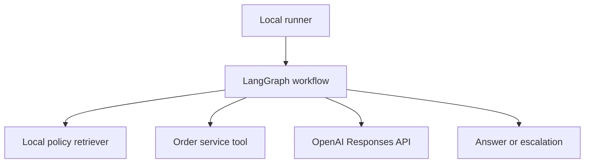
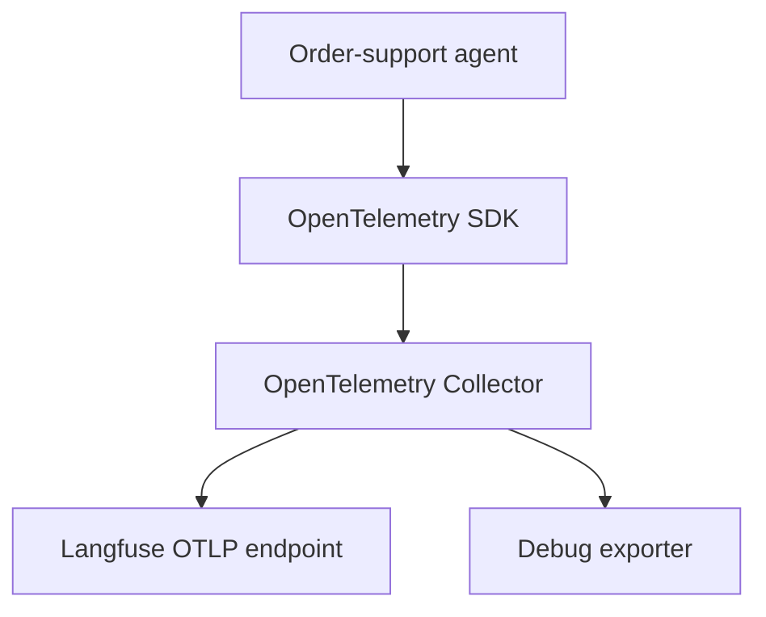

# Reference Architecture and Local Setup

This chapter creates the local foundation used by the implementation chapters. It is not a production deployment guide. The local Langfuse stack exists so the reader can inspect the full telemetry path without creating a hosted observability account or paying for a backend.

The implementation module uses a small order-support agent. It retrieves policy snippets, reads order state through a tool, calls the OpenAI Responses API, records OpenTelemetry spans, and exports traces through a local Collector into Langfuse.

The domain is intentionally small. The boundaries are not. This setup includes the pieces that make agent observability difficult in production: model calls, retrieval, tools, branching, runtime budgets, content policy, telemetry export, and backend inspection.

## Architecture

The runtime path and the telemetry path are easier to read separately.

The runtime path is the agent execution:



The telemetry path is the observability pipeline:



The application exports OTLP to the Collector. It does not send telemetry directly to Langfuse. This keeps filtering, batching, sampling, and backend credentials outside application code.

The local setup has three important boundaries:

| Boundary | Why it exists |
|---|---|
| Application to Collector | Application code emits OTLP; Collector owns processing and export. |
| Collector to Langfuse | Backend credentials stay in Collector configuration. |
| Agent data to telemetry | Content capture remains disabled unless a later chapter explicitly enables it. |

## Project layout

Create the demo project with this shape:

```txt
agent-observability-demo/
├── .env.example
├── .gitignore
├── collector-config.yaml
├── compose.yaml
├── requirements.txt
├── requirements.lock.txt
├── infrastructure/
│   └── langfuse/
├── src/
│   └── agent_observability/
│       ├── __init__.py
│       ├── config.py
│       ├── graph.py
│       ├── inference.py
│       ├── main.py
│       ├── retrieval.py
│       ├── telemetry.py
│       └── tools.py
└── tests/
    ├── test_graph.py
    ├── test_privacy.py
    └── test_telemetry.py
```

The layout separates application code, telemetry wiring, local infrastructure, and tests. Later chapters fill these files in one layer at a time.

## Create the Python environment

Start with an isolated virtual environment:

```sh
mkdir agent-observability-demo
cd agent-observability-demo
python -m venv .venv
source .venv/bin/activate
python -m pip install --upgrade pip
```

Create `requirements.txt`:

```txt
langgraph>=1.0,<2
openai>=2,<3
opentelemetry-api>=1.39,<2
opentelemetry-sdk>=1.39,<2
opentelemetry-exporter-otlp-proto-http>=1.39,<2
pydantic>=2.10,<3
pydantic-settings>=2.7,<3
pytest>=8,<9
```

Then install and lock the local run:

```sh
python -m pip install -r requirements.txt
python -m pip freeze > requirements.lock.txt
```

The version ranges keep the tutorial readable. The generated lock file makes the local run reproducible. Production projects should use their established dependency, vulnerability, and upgrade process.

## Configuration

Create `.env.example`:

```sh
OPENAI_API_KEY=replace-me
OPENAI_MODEL=replace-with-current-responses-model
OTEL_EXPORTER_OTLP_TRACES_ENDPOINT=http://localhost:4318/v1/traces
OTEL_SERVICE_NAME=order-support-agent
DEPLOYMENT_ENVIRONMENT=development
AGENT_VERSION=local
CAPTURE_CONTENT=false
MAX_AGENT_ITERATIONS=6
MAX_MODEL_CALLS=4
```

Set `OPENAI_MODEL` to a current Responses API model available to the account. The rest of the series treats the model value as configuration, not as part of the observability model.

Copy it locally and keep secrets out of Git:

```sh
cp .env.example .env
```

```txt title=".gitignore"
.env
.venv/
__pycache__/
.pytest_cache/
```

Create `src/agent_observability/config.py`:

```python
from pydantic import Field
from pydantic_settings import BaseSettings, SettingsConfigDict


class Settings(BaseSettings):
    model_config = SettingsConfigDict(env_file=".env", extra="ignore")

    openai_api_key: str
    openai_model: str
    otel_exporter_otlp_traces_endpoint: str = (
        "http://localhost:4318/v1/traces"
    )
    otel_service_name: str = "order-support-agent"
    deployment_environment: str = "development"
    agent_version: str = "local"
    capture_content: bool = False
    max_agent_iterations: int = Field(default=6, ge=1, le=20)
    max_model_calls: int = Field(default=4, ge=1, le=20)


settings = Settings()  # pyright: ignore[reportCallIssue]
```


## Start Langfuse locally

This setup starts Langfuse locally so the rest of the series can show the full telemetry path without requiring a hosted account. It is a learning environment, not a production recommendation.

Use the current official self-hosting files instead of copying an abbreviated Compose configuration into the article. The official Docker Compose guide is the source of truth if file names or required variables change.

```sh
git clone --depth 1 https://github.com/langfuse/langfuse.git infrastructure/langfuse
cd infrastructure/langfuse
cp .env.prod.example .env
```

Replace every secret marked `CHANGEME`, then start the stack:

```sh
docker compose up -d
docker compose ps
```

Open `http://localhost:3000`, create a project, and create API keys.

Docker Compose is appropriate for local learning and integration troubleshooting. Do not treat this Compose stack as a production observability platform. Production use needs a separately designed deployment model with high availability, backups, scaling, secret management, network controls, retention, and upgrade procedures.

## OpenAI data storage setting

The implementation uses the Responses API with `store=False`. OpenAI documents that Responses are stored by default unless storage is disabled. Response storage is separate from telemetry content capture: disabling OpenAI response storage does not prevent our own application, Collector, or backend from exporting content.

Keep the controls separate:

| Control | What it affects |
|---|---|
| `store=False` on OpenAI Responses API calls | OpenAI response storage for that API request, subject to organization data controls. |
| `CAPTURE_CONTENT=false` in this project | Whether the demo instrumentation exports prompts, outputs, tool payloads, or retrieved text. |
| Collector filtering and backend configuration | What telemetry is processed, exported, stored, and retained after the SDK emits it. |

All three must be configured deliberately.

## Verify prerequisites

Return to the demo project root before running these checks:

```sh
cd ../../
```

Verify Python dependencies:

```sh
python -c "import langgraph, openai, opentelemetry; print('dependencies ok')"
```

Verify Langfuse health:

```sh
curl -fsS http://localhost:3000/api/public/health
```

Verify the local safety defaults:

```sh
PYTHONPATH=src python - <<'PY'
from agent_observability.config import settings

assert settings.capture_content is False
assert settings.deployment_environment == "development"
assert settings.max_agent_iterations <= 20
assert settings.max_model_calls <= 20
print("configuration ok")
PY
```

Do not continue if the backend is unhealthy, placeholder Langfuse secrets remain in the Compose environment, or `.env` contains a real API key that is tracked by Git.

## What should exist before we go to Chapter 13

At the end of this chapter, the local environment should have:

1. A Python project with dependencies installed and locked.
2. A `.env` file outside version control.
3. A configuration object that keeps secrets out of telemetry.
4. A local Langfuse stack reachable at `http://localhost:3000`.
5. A Langfuse project with API keys ready for the Collector.
6. Content capture disabled by default.

Chapter 13 uses this foundation to configure the OpenTelemetry SDK and Collector.

## References

- [OpenAI Responses API](https://developers.openai.com/api/docs/guides/migrate-to-responses)
- [OpenAI data controls](https://developers.openai.com/api/docs/guides/your-data)
- [LangGraph overview](https://docs.langchain.com/oss/python/langgraph)
- [Langfuse Docker Compose deployment](https://langfuse.com/self-hosting/deployment/docker-compose)
- [Langfuse OpenTelemetry endpoint](https://langfuse.com/integrations/native/opentelemetry)
- [OpenTelemetry Python](https://opentelemetry.io/docs/languages/python/)

---

**Next up**: [Ch 13 - Building the OpenTelemetry Pipeline](/observability-ai-agents/ch-13-opentelemetry-collector-langfuse-pipeline/) sends one verified trace through the Collector into Langfuse.
