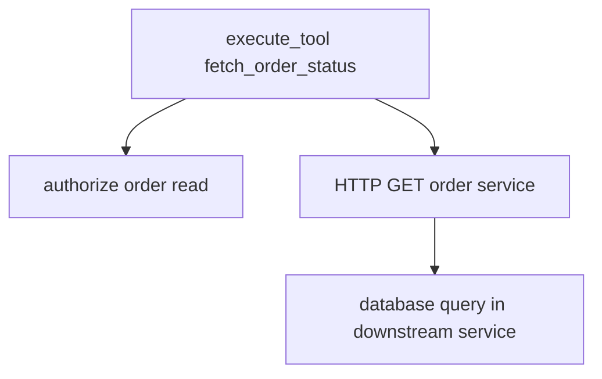

# Instrumenting Tools, Retrieval, and Memory

Tools create effects, retrieval supplies evidence, and memory carries state across interactions. Once model-call spans are in place, most confusing incidents move to these boundaries: the model asked for the right thing but the tool was denied, retrieval returned stale policy, or memory injected state that nobody expected.

This chapter instruments those boundaries without turning traces into a copy of the application's private data. The pattern is the same throughout: record the operation, decision, version, and outcome; keep raw arguments, retrieved text, and memory values behind the content-capture policy from Chapter 7.

For the practical work, copy each file as it appears and focus on understanding what each span records. The wrappers are easier to validate together than one by one, so the end of the chapter runs all three operations and shows what to inspect in Langfuse before moving to the LangGraph workflow.

## Separate tool semantics from downstream calls

A tool span describes the capability the agent invoked. HTTP, database, or messaging instrumentation below it describes how the capability was executed.

The first wrapper in this chapter instruments a read-only tool: `fetch_order_status`. It records the tool name, side-effect class, schema version, authorization decision, and bounded result metadata. It does not record the order reference or subject identifier because those values are application data, not telemetry dimensions.

This span should sit above the downstream client calls. If the tool implementation calls an HTTP service, a database, or a queue, those lower-level libraries can create their own child spans. The tool span gives those child spans application meaning.



Create `src/agent_observability/tools.py` and add the tool wrapper there:

```python
from dataclasses import dataclass
from opentelemetry.trace import SpanKind, Status, StatusCode

from .telemetry import tracer


@dataclass(frozen=True)
class OrderStatus:
    state: str
    delayed: bool
    region: str


def authorize_order_read(subject_id: str, order_reference: str) -> bool:
    return bool(subject_id) and order_reference.startswith("ORDER-")


def call_order_service(order_reference: str) -> OrderStatus:
    if order_reference.endswith("404"):
        return OrderStatus(state="missing", delayed=False, region="unknown")
    if order_reference.endswith("EU"):
        return OrderStatus(state="in_transit", delayed=True, region="eu")
    return OrderStatus(state="processing", delayed=False, region="global")


def validate_order_reference(order_reference: str) -> bool:
    return order_reference.startswith("ORDER-") and len(order_reference) >= 8


def fetch_order_status(
    order_reference: str,
    subject_id: str,
    *,
    tool_call_id: str | None = None,
) -> OrderStatus:
    with tracer.start_as_current_span(
        "execute_tool fetch_order_status",
        kind=SpanKind.INTERNAL,
        attributes={
            "gen_ai.operation.name": "execute_tool",
            "gen_ai.tool.name": "fetch_order_status",
            "gen_ai.tool.type": "function",
            "app.tool.side_effect": "read",
            "app.tool.schema_version": "2",
        },
    ) as span:
        if tool_call_id is not None:
            span.set_attribute("gen_ai.tool.call.id", tool_call_id)

        arguments_valid = validate_order_reference(order_reference)
        span.set_attribute("app.tool.arguments.valid", arguments_valid)
        span.set_attribute("app.tool.approval", "not_required")
        if not arguments_valid:
            span.set_attribute("error.type", "validation")
            span.set_status(Status(StatusCode.ERROR, "validation"))
            raise ValueError("invalid order reference")

        allowed = authorize_order_read(subject_id, order_reference)
        span.set_attribute(
            "app.tool.authorization",
            "allowed" if allowed else "denied",
        )
        if not allowed:
            span.set_attribute("error.type", "authorization")
            span.set_status(Status(StatusCode.ERROR, "authorization"))
            raise PermissionError("order access denied")

        result = call_order_service(order_reference)
        span.set_attribute("app.tool.execution", "success")
        span.set_attribute("app.order.state", result.state)
        span.set_attribute("app.order.delayed", result.delayed)
        span.set_attribute("app.order.region", result.region)
        return result
```

`authorize_order_read` and `call_order_service` are local stand-ins for the order system so the chapter remains runnable. In a real application, replace them with the real policy check and service client. The important part is where the span sits: above the downstream HTTP or database client instrumentation, with application semantics attached before and after the call.

`order_reference` and `subject_id` are deliberately absent from span attributes. They can appear in a restricted audit system if required by policy.

## Validate before execution

The model proposes tool arguments; application code validates and authorizes them. Put validation before the real tool action in `src/agent_observability/tools.py`, inside the specific tool wrapper or in a helper that the wrapper calls.

If you copied the complete `fetch_order_status` wrapper from the previous section, this validation code is already included. Use this section to understand and verify the specific controls that make validation observable instead of adding the helper a second time.

The wrapper records four controls separately: argument validation, authorization, approval requirement, and execution outcome. This makes incidents easier to classify: invalid arguments, authorization denial, missing approval, and execution failure are different problems.

After this change, the successful path should record:

```txt
app.tool.arguments.valid = true
app.tool.authorization = "allowed"
app.tool.approval = "not_required"
app.tool.execution = "success"
```

A validation error is not a provider inference error. Attach it to the tool or orchestration span with a bounded error category. Do not copy the raw invalid arguments into the span; record the failing field path or schema rule only when it is safe.

## Tool-call IDs

When OpenAI returns a function call, preserve `call_id` to connect the model output item, local execution, and `function_call_output`. Pass it from the model tool loop into the local wrapper as `tool_call_id`, as shown in `fetch_order_status`, and record it as `gen_ai.tool.call.id` on the tool span.

There is no extra code to add to `tools.py` in this section if you copied the complete wrapper earlier. The `tool_call_id` parameter and span attribute are already there. The missing piece is the orchestration code that receives a tool call from OpenAI and passes its `call_id` into `fetch_order_status`. Chapter 16 adds that connection when the tool wrapper becomes part of a LangGraph node.

This belongs in the orchestration code that reads model output items and executes local tools. In the next chapter, that orchestration becomes a LangGraph node; the same rule applies there.

`call_id` is high cardinality and belongs on spans, not metrics.

The tool loop must pass every required model output item back to the Responses API, including reasoning items returned alongside tool calls. Follow the current function-calling guide rather than rebuilding response state from text.

## Retrieval spans

Retrieval spans explain where grounding evidence came from. The span should identify the data source, strategy, requested result count, returned result count, index version, and approved evidence identifiers. It should not export query text or document chunks by default.

This wrapper becomes the retrieval operation called by the graph in Chapter 16. Keep it separate from the graph so retrieval behavior can be tested and evolved without rewriting workflow code.

Create `src/agent_observability/retrieval.py` and add the retrieval wrapper there:

```python
from dataclasses import dataclass
from opentelemetry.trace import SpanKind

from .telemetry import tracer


@dataclass(frozen=True)
class RetrievedDocument:
    document_id: str
    score: float
    text: str


def search_policy_index(
    *,
    query: str,
    region: str,
    top_k: int,
) -> list[RetrievedDocument]:
    documents = [
        RetrievedDocument(
            document_id=f"policy-{region}-shipping-v14",
            score=0.91,
            text="Delayed orders should include an estimated delivery update.",
        ),
        RetrievedDocument(
            document_id=f"policy-{region}-escalation-v3",
            score=0.72,
            text="Escalate when order state is missing or policy evidence is insufficient.",
        ),
    ]
    if "refund" in query.lower():
        documents.append(
            RetrievedDocument(
                document_id=f"policy-{region}-refunds-v8",
                score=0.68,
                text="Refund requests require an approved refund workflow.",
            ),
        )
    return documents[:top_k]


def retrieve_policy(query: str, region: str) -> list[RetrievedDocument]:
    with tracer.start_as_current_span(
        "retrieval support-policy",
        kind=SpanKind.CLIENT,
        attributes={
            "gen_ai.operation.name": "retrieval",
            "gen_ai.data_source.id": "support-policy",
            "gen_ai.retrieval.top_k": 5,
            "app.retrieval.index.version": "2026-06-15",
            "app.retrieval.strategy": "hybrid-rerank",
            "app.retrieval.region": region,
        },
    ) as span:
        documents = search_policy_index(query=query, region=region, top_k=5)
        span.set_attribute("app.retrieval.result_count", len(documents))
        span.set_attribute("app.retrieval.empty", not documents)
        span.set_attribute(
            "app.retrieval.document_ids",
            [document.document_id for document in documents],
        )
        span.set_attribute(
            "app.retrieval.document_scores",
            [document.score for document in documents],
        )
        return documents
```

`search_policy_index` is a local stand-in for the vector, keyword, or hybrid search implementation. Replace it with the real retriever when connecting the demo to an index, hosted retriever, database extension, or internal search service. The wrapper records the retrieval contract that explains later behavior.

Document IDs and scores are trace attributes, not metric labels. Confirm that IDs are opaque and safe before exporting. Document text and query remain local when content capture is disabled.

## Retrieval quality

Retrieval quality is not only "did the search return something?" A retriever can return five documents quickly and still fail if the policy is stale, unauthorized, or irrelevant.

Record the configuration and evidence needed for evaluation on the retrieval span, the evaluation record, or both. Use the span for operational debugging and the evaluation record for judgment over correctness or grounding.

- Embedding model and version.
- Index build or corpus version.
- Search and reranker versions.
- Filters and access-control policy result.
- Requested and returned result count.
- Document IDs, ranks, and scores where approved.
- Whether cited documents were actually used.

Do not compare raw scores across different retrievers as if they shared one scale.

## Memory operations

Memory instrumentation answers a different question from retrieval. Retrieval brings evidence from an index or corpus. Memory brings state from earlier turns or previous conversations. Both can change behavior, but memory is more likely to contain personal or preference data.

Separate working state from long-term memory before choosing what to record:

| State | Scope | Telemetry |
|---|---|---|
| Graph state | Current execution | State version, node transition, safe field presence. |
| Conversation history | Several turns | Conversation ID, turn count, compaction event. |
| Long-term memory | Across conversations | Store, operation, record count, policy decision. |

Memory reads and writes deserve spans when they call an external store or materially affect behavior. Record operation, store, latency, result count, and error. Do not export memory contents by default.

Create `src/agent_observability/memory.py` and add the memory wrapper there:

```python
from dataclasses import dataclass
from opentelemetry.trace import SpanKind

from .telemetry import tracer


@dataclass(frozen=True)
class MemoryRecord:
    record_id: str
    memory_type: str
    value: str


class LocalMemoryStore:
    def read(self, *, subject_id: str, purpose: str) -> list[MemoryRecord]:
        if not subject_id:
            return []
        return [
            MemoryRecord(
                record_id="mem_001",
                memory_type="support_preference",
                value=f"Use concise updates for {purpose}.",
            ),
        ]


memory_store = LocalMemoryStore()


def read_customer_memory(subject_id: str, purpose: str) -> list[MemoryRecord]:
    with tracer.start_as_current_span(
        "memory.read customer-profile",
        kind=SpanKind.CLIENT,
        attributes={
            "app.memory.operation": "read",
            "app.memory.store": "customer-profile",
            "app.memory.purpose": purpose,
            "app.memory.policy_decision": "allowed",
        },
    ) as span:
        records = memory_store.read(subject_id=subject_id, purpose=purpose)
        span.set_attribute("app.memory.record_count", len(records))
        span.set_attribute(
            "app.memory.record_types",
            sorted({record.memory_type for record in records}),
        )
        return records
```

`subject_id`, `record_id`, and `value` stay out of telemetry. For debugging, the useful question is usually whether memory was read, which store and policy were involved, and which category of memory influenced the turn.

## Writes, idempotency, and approvals

Read tools can usually run after validation and authorization. Write tools need more controls because they change the system of record.

When you add a side-effecting tool wrapper to `src/agent_observability/tools.py`, put these attributes on the span for that write tool, not on the root task span, retrieval span, or memory span.

For example, if you later add an `issue_refund` tool, these values belong in the `attributes={...}` block passed to `tracer.start_as_current_span(...)` for `execute_tool issue_refund`:

```txt
app.tool.side_effect = "write"
app.tool.approval = "approved"
app.tool.idempotency = "replayed"
app.tool.compensation_available = true
```

State returned by the system of record should be added to the same write-tool span after the write call returns:

```python
result = call_refund_service(...)
span.set_attribute("app.tool.execution", "success")
span.set_attribute("app.refund.state", result.state)
span.set_attribute("app.refund.compensation_available", result.can_reverse)
```

Record the state transition returned by the system of record. A model saying “the refund was issued” is not evidence that the write succeeded. The trace should show the approval decision, idempotency behavior, write result, and whether compensation is available.

## Running the chapter demo

At this point, run the three wrappers before moving to LangGraph. This confirms that tool, retrieval, and memory spans appear under one agent task span and that the wrappers do not export raw arguments, retrieved text, or memory values by default.

Update `src/agent_observability/main.py` so it calls the files created in this chapter:

```python
from uuid import uuid4

from .memory import read_customer_memory
from .retrieval import retrieve_policy
from .telemetry import agent_task_span, configure_tracing
from .tools import fetch_order_status


def main() -> None:
    provider = configure_tracing()
    conversation_id = f"conv_{uuid4().hex}"
    subject_id = "subject_demo"

    with agent_task_span("order-status", conversation_id) as span:
        documents = retrieve_policy(
            query="Where is my delayed EU order?",
            region="eu",
        )
        memory_records = read_customer_memory(
            subject_id=subject_id,
            purpose="order-status-support",
        )
        order = fetch_order_status(
            order_reference="ORDER-123EU",
            subject_id=subject_id,
            tool_call_id="call_demo_001",
        )

        span.set_attribute("app.task.outcome", "success")
        span.set_attribute("app.retrieval.documents.used", len(documents))
        span.set_attribute("app.memory.records.used", len(memory_records))
        span.set_attribute("app.order.state", order.state)

    provider.force_flush(timeout_millis=5000)
    provider.shutdown()


if __name__ == "__main__":
    main()
```

Run it from the demo project root:

```sh
PYTHONPATH=src python -m agent_observability.main
```

The command should exit without errors. If it fails before exporting, fix the Python exception first; if it succeeds but no trace appears, debug the Collector and Langfuse pipeline from Chapter 13.

## Inspect the trace in Langfuse

Open Langfuse and go to **Tracing**. Open the newest `invoke_agent order-status` trace.

The expected trace shape is:

```txt
invoke_agent order-status
  retrieval support-policy
  memory.read customer-profile
  execute_tool fetch_order_status
```

Inspect the `execute_tool fetch_order_status` span. It should include:

```txt
gen_ai.operation.name = "execute_tool"
gen_ai.tool.name = "fetch_order_status"
gen_ai.tool.type = "function"
gen_ai.tool.call.id = "call_demo_001"
app.tool.side_effect = "read"
app.tool.schema_version = "2"
app.tool.arguments.valid = true
app.tool.authorization = "allowed"
app.tool.approval = "not_required"
app.tool.execution = "success"
app.order.state = "in_transit"
app.order.delayed = true
app.order.region = "eu"
```

Inspect the `retrieval support-policy` span. It should include:

```txt
gen_ai.operation.name = "retrieval"
gen_ai.data_source.id = "support-policy"
gen_ai.retrieval.top_k = 5
app.retrieval.index.version = "2026-06-15"
app.retrieval.strategy = "hybrid-rerank"
app.retrieval.result_count = 2
app.retrieval.empty = false
app.retrieval.document_ids = ["policy-eu-shipping-v14", "policy-eu-escalation-v3"]
```

Inspect the `memory.read customer-profile` span. It should include:

```txt
app.memory.operation = "read"
app.memory.store = "customer-profile"
app.memory.purpose = "order-status-support"
app.memory.policy_decision = "allowed"
app.memory.record_count = 1
app.memory.record_types = ["support_preference"]
```

Then check the privacy boundary. These values should not appear in span attributes:

- `ORDER-123EU`
- `subject_demo`
- `Where is my delayed EU order?`
- retrieved document text;
- memory `value`.

If one of those values appears, fix the wrapper before continuing. Chapter 16 builds graph nodes on top of these functions, so a leak here becomes a leak inside the workflow trace.

## What should exist before we go to Chapter 16

At this point the demo should have:

- a tool wrapper that records tool name, side-effect class, authorization, execution outcome, and `gen_ai.tool.call.id` when the model provided one;
- a retrieval wrapper that records data source, retrieval strategy, requested result count, returned result count, index version, document IDs, and scores without exporting retrieved text by default;
- a memory wrapper that records store, operation, purpose, policy decision, record count, and memory categories without exporting memory values;
- a clear split between application spans and downstream HTTP, database, or messaging spans;
- no tool arguments, retrieval queries, retrieved chunks, subject identifiers, or memory values in telemetry by default.
- one validated Langfuse trace showing retrieval, memory, and tool spans under `invoke_agent order-status`.

Chapter 16 wires these operations into LangGraph nodes. `retrieve_policy`, `fetch_order_status`, and memory reads become child operations inside workflow-node spans, and the graph state carries only the fields needed to route the task.

## References

- [OpenAI function calling](https://developers.openai.com/api/docs/guides/function-calling)
- [OpenAI Responses API migration guide](https://developers.openai.com/api/docs/guides/migrate-to-responses)
- [OpenTelemetry GenAI semantic conventions](https://github.com/open-telemetry/semantic-conventions-genai)
- [OpenTelemetry database semantic conventions](https://opentelemetry.io/docs/specs/semconv/database/)
- [OWASP LLM06: Excessive Agency](https://genai.owasp.org/llmrisk/llm062025-excessive-agency/)

---

**Next up**: [Ch 16 - Instrumenting LangGraph and Multi-Agent Workflows](/observability-ai-agents/ch-16-langgraph-multi-agent-workflows/) connects workflow nodes, branches, parallelism, checkpoints, and handoffs.
