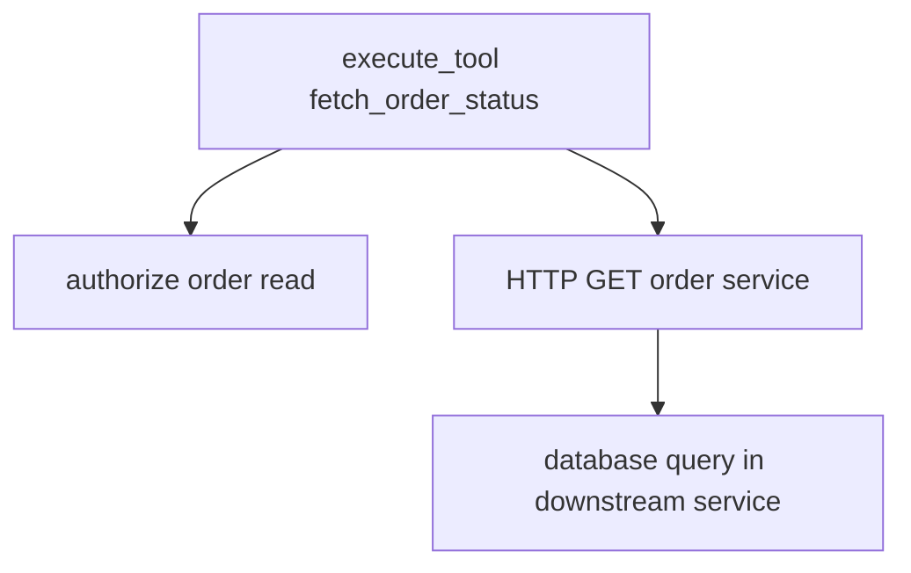

# Instrumenting Tools, Retrieval, and Memory

Tools create effects, retrieval supplies evidence, and memory carries state across interactions. Once model-call spans are in place, most confusing incidents move to these boundaries: the model asked for the right thing but the tool was denied, retrieval returned stale policy, or memory injected state that nobody expected.

This chapter instruments those boundaries without turning traces into a copy of the application's private data. The pattern is the same throughout: record the operation, decision, version, and outcome; keep raw arguments, retrieved text, and memory values behind the content-capture policy from Chapter 7.

## Separate tool semantics from downstream calls

A tool span describes the capability the agent invoked. HTTP, database, or messaging instrumentation below it describes how the capability was executed.



Create `src/agent_observability/tools.py`:

```python
from dataclasses import dataclass
from opentelemetry.trace import SpanKind, Status, StatusCode

from .telemetry import tracer


@dataclass(frozen=True)
class OrderStatus:
    state: str
    delayed: bool
    region: str


def fetch_order_status(
    order_reference: str,
    subject_id: str,
    *,
    tool_call_id: str | None = None,
) -> OrderStatus:
    with tracer.start_as_current_span(
        "execute_tool fetch_order_status",
        kind=SpanKind.INTERNAL,
        attributes={
            "gen_ai.operation.name": "execute_tool",
            "gen_ai.tool.name": "fetch_order_status",
            "gen_ai.tool.type": "function",
            "app.tool.side_effect": "read",
            "app.tool.schema_version": "2",
        },
    ) as span:
        if tool_call_id is not None:
            span.set_attribute("gen_ai.tool.call.id", tool_call_id)

        allowed = authorize_order_read(subject_id, order_reference)
        span.set_attribute(
            "app.tool.authorization",
            "allowed" if allowed else "denied",
        )
        if not allowed:
            span.set_attribute("error.type", "authorization")
            span.set_status(Status(StatusCode.ERROR, "authorization"))
            raise PermissionError("order access denied")

        result = call_order_service(order_reference)
        span.set_attribute("app.order.state", result.state)
        span.set_attribute("app.order.delayed", result.delayed)
        span.set_attribute("app.order.region", result.region)
        return result
```

`authorize_order_read` and `call_order_service` represent application code from the order system. The important part is where the span sits: above the downstream HTTP or database client instrumentation, with application semantics attached before and after the call.

`order_reference` and `subject_id` are deliberately absent from span attributes. They can appear in a restricted audit system if required by policy.

## Validate before execution

The model proposes tool arguments; application code validates and authorizes them. Record each control separately:

```txt
app.tool.arguments.valid = true
app.tool.authorization = "allowed"
app.tool.approval = "not_required"
app.tool.execution = "success"
```

A validation error is not a provider inference error. Attach it to the tool or orchestration span with a bounded error category.

## Tool-call IDs

When OpenAI returns a function call, preserve `call_id` to connect the model output item, local execution, and `function_call_output`. Record it as `gen_ai.tool.call.id` on the tool span. It is high cardinality and belongs on spans, not metrics.

The tool loop must pass every required model output item back to the Responses API, including reasoning items returned alongside tool calls. Follow the current function-calling guide rather than rebuilding response state from text.

## Retrieval spans

Create `src/agent_observability/retrieval.py`:

```python
from dataclasses import dataclass
from opentelemetry.trace import SpanKind

from .telemetry import tracer


@dataclass(frozen=True)
class RetrievedDocument:
    document_id: str
    score: float
    text: str


def retrieve_policy(query: str, region: str) -> list[RetrievedDocument]:
    with tracer.start_as_current_span(
        "retrieval support-policy",
        kind=SpanKind.CLIENT,
        attributes={
            "gen_ai.operation.name": "retrieval",
            "gen_ai.data_source.id": "support-policy",
            "gen_ai.retrieval.top_k": 5,
            "app.retrieval.index.version": "2026-06-15",
            "app.retrieval.strategy": "hybrid-rerank",
            "app.retrieval.region": region,
        },
    ) as span:
        documents = search_policy_index(query=query, region=region, top_k=5)
        span.set_attribute("app.retrieval.result_count", len(documents))
        span.set_attribute("app.retrieval.empty", not documents)
        span.set_attribute(
            "app.retrieval.document_ids",
            [document.document_id for document in documents],
        )
        span.set_attribute(
            "app.retrieval.document_scores",
            [document.score for document in documents],
        )
        return documents
```

`search_policy_index` is the vector, keyword, or hybrid search implementation for the application. This wrapper does not care whether it calls a hosted retriever, a database extension, or an internal search service. It records the retrieval contract that explains later behavior.

Document IDs and scores are trace attributes, not metric labels. Confirm that IDs are opaque and safe before exporting. Document text and query remain local when content capture is disabled.

## Retrieval quality

Record configuration and evidence needed for evaluation:

- Embedding model and version.
- Index build or corpus version.
- Search and reranker versions.
- Filters and access-control policy result.
- Requested and returned result count.
- Document IDs, ranks, and scores where approved.
- Whether cited documents were actually used.

Do not compare raw scores across different retrievers as if they shared one scale.

## Memory operations

Separate working state from long-term memory:

| State | Scope | Telemetry |
|---|---|---|
| Graph state | Current execution | State version, node transition, safe field presence. |
| Conversation history | Several turns | Conversation ID, turn count, compaction event. |
| Long-term memory | Across conversations | Store, operation, record count, policy decision. |

Memory reads and writes deserve spans when they call an external store or materially affect behavior. Record operation, store, latency, result count, and error. Do not export memory contents by default.

Create `src/agent_observability/memory.py`:

```python
from dataclasses import dataclass
from opentelemetry.trace import SpanKind

from .telemetry import tracer


@dataclass(frozen=True)
class MemoryRecord:
    record_id: str
    memory_type: str
    value: str


def read_customer_memory(subject_id: str, purpose: str) -> list[MemoryRecord]:
    with tracer.start_as_current_span(
        "memory.read customer-profile",
        kind=SpanKind.CLIENT,
        attributes={
            "app.memory.operation": "read",
            "app.memory.store": "customer-profile",
            "app.memory.purpose": purpose,
            "app.memory.policy_decision": "allowed",
        },
    ) as span:
        records = memory_store.read(subject_id=subject_id, purpose=purpose)
        span.set_attribute("app.memory.record_count", len(records))
        span.set_attribute(
            "app.memory.record_types",
            sorted({record.memory_type for record in records}),
        )
        return records
```

`subject_id`, `record_id`, and `value` stay out of telemetry. For debugging, the useful question is usually whether memory was read, which store and policy were involved, and which category of memory influenced the turn.

## Writes, idempotency, and approvals

For side-effecting tools, add:

```txt
app.tool.side_effect = "write"
app.tool.approval = "approved"
app.tool.idempotency = "replayed"
app.tool.compensation_available = true
```

Record the state transition returned by the system of record. A model saying “the refund was issued” is not evidence that the write succeeded.

## What should exist before we go to Chapter 16

At this point the demo should have:

- a tool wrapper that records tool name, side-effect class, authorization, execution outcome, and `gen_ai.tool.call.id` when the model provided one;
- a retrieval wrapper that records data source, retrieval strategy, requested result count, returned result count, index version, document IDs, and scores without exporting retrieved text by default;
- a memory wrapper that records store, operation, purpose, policy decision, record count, and memory categories without exporting memory values;
- a clear split between application spans and downstream HTTP, database, or messaging spans;
- no tool arguments, retrieval queries, retrieved chunks, subject identifiers, or memory values in telemetry by default.

Chapter 16 wires these operations into LangGraph nodes. `retrieve_policy`, `fetch_order_status`, and memory reads become child operations inside workflow-node spans, and the graph state carries only the fields needed to route the task.

## References

- [OpenAI function calling](https://developers.openai.com/api/docs/guides/function-calling)
- [OpenAI Responses API migration guide](https://developers.openai.com/api/docs/guides/migrate-to-responses)
- [OpenTelemetry GenAI semantic conventions](https://github.com/open-telemetry/semantic-conventions-genai)
- [OpenTelemetry database semantic conventions](https://opentelemetry.io/docs/specs/semconv/database/)
- [OWASP LLM06: Excessive Agency](https://genai.owasp.org/llm-top-10/)

---

**Next up**: [Ch 16 - Instrumenting LangGraph and Multi-Agent Workflows](/observability-ai-agents/ch-16-langgraph-multi-agent-workflows/) connects workflow nodes, branches, parallelism, checkpoints, and handoffs.
