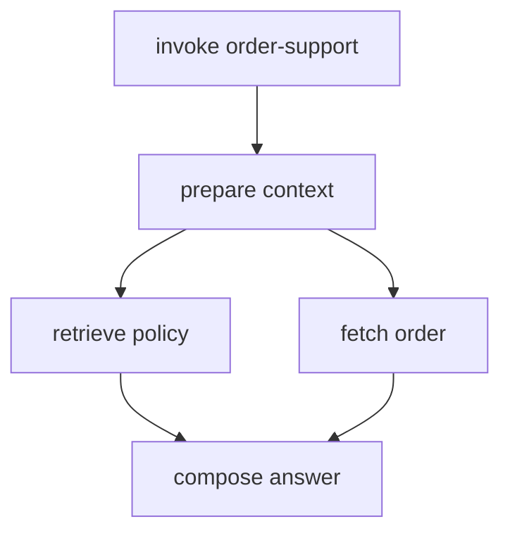

# Instrumenting LangGraph and Multi-Agent Workflows

Chapter 15 created spans for model-adjacent operations: tools, retrieval, and memory. LangGraph is where those operations become an execution path. The graph decides which operation runs, which state fields change, when work branches, and where the task stops.

Framework instrumentation can expose graph activity, but the application still owns business semantics. A node named `call_model` does not explain whether it routed a request, verified an outcome, or prepared a write action. Add spans at boundaries that matter during an incident.

## Define observable state without exporting it

The first step is to define the graph state contract. LangGraph state is the object that moves from node to node, so it will contain user input, conversation identifiers, retrieved evidence references, tool results, model output, and routing decisions.

That does not mean the whole state should become telemetry. In this section, the goal is to separate fields the workflow needs from fields the observability backend may safely see. The graph will keep full values in memory, while spans record only selected metadata such as updated field names, iteration count, route outcome, document IDs, and bounded task outcomes.

This contract also prepares the tests in Chapter 23. If a node adds a new state field later, the trace should show that the field changed without leaking the value.

Create `src/agent_observability/graph.py`:

```python
from typing import TypedDict

from langgraph.graph import END, START, StateGraph


class AgentState(TypedDict, total=False):
    query: str
    conversation_id: str
    order_reference: str
    region: str
    policy_document_ids: list[str]
    memory_record_types: list[str]
    order_state: str
    answer: str
    outcome: str
    iterations: int
```

The state contains content and identifiers that should not be copied wholesale into telemetry. Instrument selected metadata at each node.

## Wrap nodes with operation spans

After the state contract is explicit, wrap each graph node with an operation span. The node span should answer a workflow question: "Which node ran, in which iteration, and which state fields did it update?"

This wrapper is intentionally small. It does not inspect the full state, serialize arguments, or copy return values into telemetry. It records the node name, the current iteration, and the list of updated field names. The retrieval, memory, tool, and model calls inside the node will create their own child spans with their own operational details.

The result is a trace that shows both layers: workflow movement at the node level and external work at the child-operation level.

Add this code to `src/agent_observability/graph.py`, below the `AgentState` definition:

```python
from collections.abc import Callable
from functools import wraps
from typing import Any

from .telemetry import tracer


Node = Callable[[AgentState], dict[str, Any]]


def traced_node(name: str) -> Callable[[Node], Node]:
    def decorate(function: Node) -> Node:
        @wraps(function)
        def wrapped(state: AgentState) -> dict[str, Any]:
            with tracer.start_as_current_span(f"workflow.node {name}") as span:
                span.set_attribute("app.workflow.node.name", name)
                span.set_attribute(
                    "app.workflow.iteration",
                    state.get("iterations", 0),
                )
                result = function(state)
                span.set_attribute(
                    "app.workflow.updated_fields",
                    sorted(result.keys()),
                )
                return result

        return wrapped

    return decorate
```

`updated_fields` reveals state shape, not values. Keep the catalog bounded so it remains queryable.

## Turn operations into graph nodes

The wrappers from Chapters 14 and 15 should run inside graph nodes. This is where the standalone instrumentation becomes an agent workflow: one node retrieves policy evidence, one node reads memory categories, one node calls the order-status tool, and one node composes the answer.

The node span explains state movement. The child operation span explains the external or capability-specific work. For example, `workflow.node fetch_order` tells us that the graph reached the order lookup step; `execute_tool fetch_order_status` tells us whether the tool was authorized and what state the order system returned.

Add these imports and node functions to `src/agent_observability/graph.py`, below `traced_node`:

```python
from .inference import generate_answer
from .memory import read_customer_memory
from .retrieval import retrieve_policy
from .tools import fetch_order_status


@traced_node("retrieve_policy")
def retrieve_policy_node(state: AgentState) -> dict[str, Any]:
    documents = retrieve_policy(
        query=state["query"],
        region=state["region"],
    )
    return {
        "policy_document_ids": [
            document.document_id for document in documents
        ],
    }


@traced_node("read_memory")
def read_memory_node(state: AgentState) -> dict[str, Any]:
    records = read_customer_memory(
        subject_id=state["conversation_id"],
        purpose="order-status-support",
    )
    return {
        "memory_record_types": sorted(
            {record.memory_type for record in records}
        ),
    }


@traced_node("fetch_order")
def fetch_order_node(state: AgentState) -> dict[str, Any]:
    order = fetch_order_status(
        order_reference=state["order_reference"],
        subject_id=state["conversation_id"],
    )
    return {"order_state": order.state}


@traced_node("compose_answer")
def compose_answer_node(state: AgentState) -> dict[str, Any]:
    answer = generate_answer(
        instructions="Answer using only the provided order and policy context.",
        input_items=[
            {
                "role": "user",
                "content": state["query"],
            },
        ],
    )
    return {"answer": answer}
```

The example uses `conversation_id` as the subject identifier to keep the chapter small. In a real application, use the authenticated subject or tenant-scoped principal, not an arbitrary conversation handle.

## Instrument branches as decisions

After the graph can run work, add the decision point that chooses the next path. In this demo, the branch is intentionally small: if the order state is missing, route to escalation; otherwise, compose an answer.

The important observability rule is that route values must come from a bounded set. A route named `answer`, `escalate`, or `retry` is useful for filtering traces. A route value copied from a model explanation is not.

Add this code to `src/agent_observability/graph.py`, below the node functions from the previous section:

```python
@traced_node("classify_outcome")
def classify_outcome(state: AgentState) -> dict[str, Any]:
    if state.get("order_state") == "missing":
        return {"outcome": "escalate"}
    return {"outcome": "answer"}


def route_outcome(state: AgentState) -> str:
    outcome = state["outcome"]
    with tracer.start_as_current_span("workflow.route outcome") as span:
        span.set_attribute("app.workflow.route", outcome)
    return outcome


@traced_node("escalate")
def escalate_node(state: AgentState) -> dict[str, Any]:
    return {"outcome": "escalated"}
```

Record the selected route from a bounded set. Do not capture an unrestricted model explanation as a route attribute.

## Build the graph

Now assemble the nodes and edges. This is the first complete LangGraph workflow in the demo, so keep it sequential. A simple graph makes it easier to confirm parent-child span relationships before introducing parallelism, durable resume, or subagents.

Add this builder block to `src/agent_observability/graph.py`, below the branch functions:

```python
builder = StateGraph(AgentState)
builder.add_node("retrieve_policy", retrieve_policy_node)
builder.add_node("read_memory", read_memory_node)
builder.add_node("fetch_order", fetch_order_node)
builder.add_node("classify_outcome", classify_outcome)
builder.add_node("compose_answer", compose_answer_node)
builder.add_node("escalate", escalate_node)

builder.add_edge(START, "retrieve_policy")
builder.add_edge("retrieve_policy", "read_memory")
builder.add_edge("read_memory", "fetch_order")
builder.add_edge("fetch_order", "classify_outcome")
builder.add_conditional_edges(
    "classify_outcome",
    route_outcome,
    {"answer": "compose_answer", "escalate": "escalate"},
)
builder.add_edge("compose_answer", END)
builder.add_edge("escalate", END)

graph = builder.compile()
```

This first graph is sequential so its trace is easy to validate. Parallelize retrieval and order lookup only after tests prove that state merging and parent context remain correct.

## Create one root span per active execution

The node spans need a parent task span. Without a root span, Langfuse can still show individual observations, but the trace will not clearly answer "what user task was this graph trying to complete?"

This function is the public entrypoint for the chapter's graph. It creates one task span, invokes the compiled graph, and records the terminal outcome. Later chapters add sessions, users, prompt versions, and scores around this same boundary.

Add this function to `src/agent_observability/graph.py`, below `graph = builder.compile()`:

```python
from .telemetry import agent_task_span


def run_agent(initial_state: AgentState) -> AgentState:
    with agent_task_span(
        "order-status",
        initial_state["conversation_id"],
    ) as span:
        result = graph.invoke(initial_state)
        span.set_attribute("app.task.outcome", result["outcome"])
        span.set_attribute(
            "app.workflow.iterations",
            result.get("iterations", 0),
        )
        return result
```

The root span describes the task segment. Child spans describe graph nodes and the model, retrieval, and tool operations inside them.

## Run the graph

Run one local graph execution before moving on. This validates that the compiled graph, root task span, route span, and operation spans are connected.

From the demo project root, run:

```sh
PYTHONPATH=src python - <<'PY'
from agent_observability.graph import run_agent

result = run_agent(
    {
        "query": "Where is my order?",
        "conversation_id": "conv_ch16_demo",
        "order_reference": "ORDER-924",
        "region": "eu",
    }
)

print(result["outcome"])
PY
```

The terminal should print:

```txt
answer
```

A healthy sequential trace now has this shape:

```txt
invoke_agent order-status
  workflow.node retrieve_policy
    retrieval support-policy
  workflow.node read_memory
    memory.read customer-profile
  workflow.node fetch_order
    execute_tool fetch_order_status
      HTTP GET order service
  workflow.node classify_outcome
  workflow.route outcome
  workflow.node compose_answer
    openai.responses.create
```

That structure is what Chapter 23 will test. If the trace only shows framework nodes, it is hard to explain behavior. If it only shows HTTP and model spans, it is hard to explain the workflow decision that caused them.

## Parallel nodes

Do not parallelize this chapter's implementation yet. This section is a design note for the next iteration after the sequential trace is validated.

When independent nodes run concurrently, their spans should overlap and share the correct causal parent. For the order-status workflow, retrieval and order lookup are candidates for parallel execution because neither needs the other's result. The compose step still needs both.

Use this diagram as the target shape when you later refactor the graph. No code change is required in this chapter part.



Do not derive end-to-end latency by summing parallel child spans.

## Checkpoints and durable resume

LangGraph checkpointers persist state for durable execution. They are useful when a graph can pause for human approval, queue work, or resume after process restart.

This chapter does not configure a checkpointer yet. When you add one, record checkpoint metadata in the checkpoint hook or immediately around the pause/resume boundary in `src/agent_observability/graph.py`. Do not export checkpoint state content.

Use attributes like these on the relevant workflow or task span:

```txt
app.workflow.checkpoint = "created"
app.workflow.checkpoint.sequence = 4
app.workflow.resume = true
app.workflow.resume_reason = "human_approval"
```

For a long pause, start a new trace segment and link it to the trace that requested approval. Preserve task and conversation identifiers according to policy.

## Subgraphs and subagents

Subgraphs and subagents introduce an ownership boundary inside the workflow. A subgraph is still part of the same local graph. A subagent usually represents a distinct role, policy, model configuration, or worker.

This chapter does not add a subagent implementation. Chapter 25 implements the advanced version with local subgraphs, synchronous subagent spans, and independently scheduled handoff traces. For now, keep the sequential graph working and use this section as the design rule for the trace relationships you will add later.

A subgraph executed synchronously can remain under the parent trace. Use an `invoke_agent` span for a distinct agent role and record its name and version.

For independently scheduled delegation:

1. End the delegation operation in the parent trace.
2. Inject trace context into the task message where the messaging model supports it.
3. Start a consumer or task span in the worker.
4. Use a span link when the work should not be a direct child.
5. Preserve a stable custom task ID for queries.

Avoid creating one trace that remains open for days only to represent organizational grouping.

## Streaming graph updates

LangGraph can stream values, updates, messages, custom events, checkpoints, and tasks. This is useful for UI updates and debugging, but it is also an easy way to leak full state into telemetry.

Chapter 26 implements streaming graph updates as a separate advanced topic. If you add streaming later, keep the streaming code near the graph invocation boundary, usually beside `run_agent` or in the API route that calls it. Do not export the `values` stream to telemetry: it contains complete graph state. Prefer lifecycle metadata from `updates`, `tasks`, or custom events with an allowlist.

## What should exist before we go to Chapter 17

At this point the demo should have:

- one root task span around `graph.invoke`;
- one workflow-node span for each meaningful graph node;
- child spans for retrieval, memory, tool execution, downstream service calls, and model calls;
- bounded route attributes for graph decisions;
- state field names in telemetry, not raw state values;
- a documented trace shape for the sequential workflow before adding parallelism or durable resume.

Chapter 17 adds the controls that keep this graph from running forever, weakening safety on fallback, or exporting content when a policy service is unavailable.

## References

- [LangGraph graph API](https://docs.langchain.com/oss/python/langgraph/graph-api)
- [LangGraph streaming](https://docs.langchain.com/oss/python/langgraph/streaming)
- [LangGraph durable execution](https://docs.langchain.com/oss/python/langgraph/durable-execution)
- [OpenTelemetry span links](https://opentelemetry.io/docs/concepts/signals/traces/#span-links)

---

**Next up**: [Ch 17 - Runtime Hardening and Feedback](/observability-ai-agents/ch-17-runtime-hardening-feedback/) adds budgets, loop controls, redaction, approvals, and trace-linked feedback.
